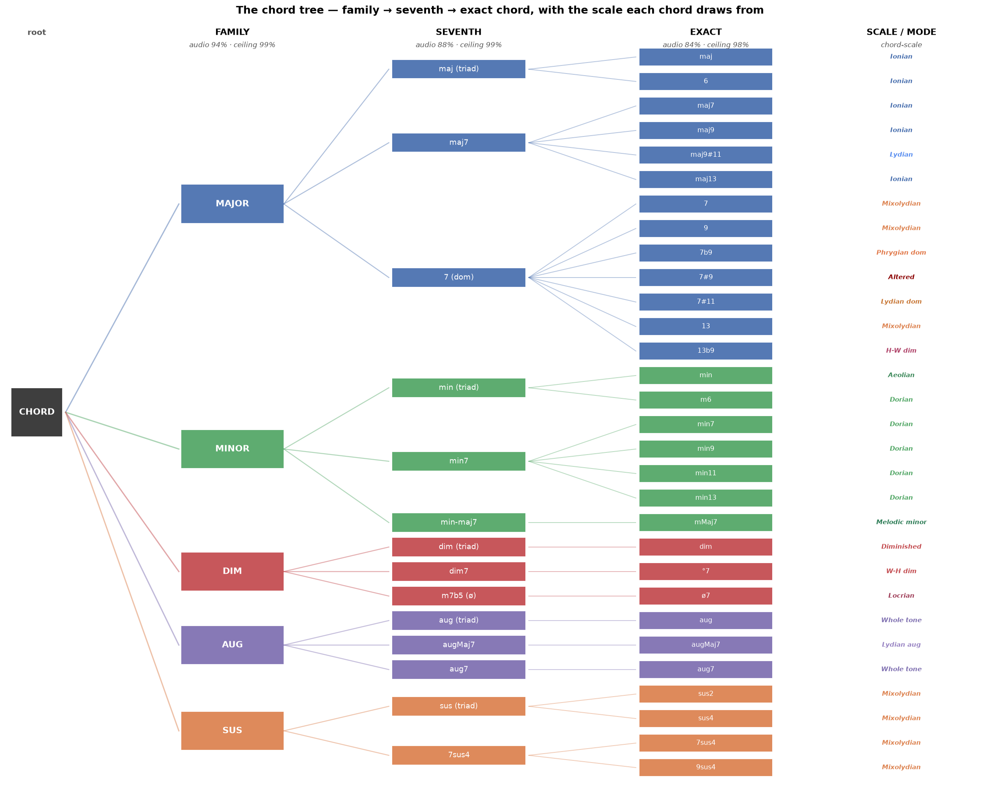

# Building Harmonia: teaching the model to hear the third (Part 6)

*Sixth in a series on building a Bayesian chord-recognition system. [Part 5](05-turning-the-pipeline-around.md)
turned the pipeline around and built a database of chord charts rendered to audio
with perfect ground truth. This part uses that database to do the thing the whole
project had been dancing around: measure exactly how much information the audio
step loses, and then get most of it back.*

## The gap, finally measured

For five parts I'd been guessing at where the chord-recognition errors came from.
With the new database I could stop guessing. Every rendered song came with a
perfect answer key — the chart. So I could ask a clean question: **if you name a
chord from the real audio, how much worse is that than naming it from the perfect
notes?**

I built the test at three levels of detail — the chord *family* (major / minor /
diminished / augmented / suspended), the *seventh* on top of it, and the *exact*
chord. With perfect note information, a simple classifier nails all three: 99%
family, 99% seventh, 98% exact. With real audio — Basic Pitch listening to the
rendered track — using the hand-written chord templates the project had always
used:

| level | fixed templates (audio) | perfect notes (ceiling) |
|---|---|---|
| family | 80% | 99% |
| seventh | 64% | 99% |
| exact | 57% | 98% |

A 40-point hole at the exact level. That hole *is* the chord-recognition problem,
and now it had a number.

## Stop describing chords, start learning them

The old approach compared the heard notes against a hand-written template of each
chord ("a major chord is root + major-third + fifth, with these weights"). The
trouble: the note detector *smears* the audio, so the real evidence never looks
like the clean template — especially the quiet notes.

So I threw the templates away and let a model learn what a chord actually looks
like *through the detector's ears* — thousands of examples of (smeared audio →
true chord). That one change closed most of the gap:

| level | fixed templates | **trained model** | ceiling |
|---|---|---|---|
| family | 80% | **94%** | 99% |
| seventh | 64% | **88%** | 99% |
| exact | 57% | **84%** | 98% |

About two-thirds of the gap, gone, just by learning the templates instead of
assuming them.

## The register trick

Chroma — folding all notes into 12 pitch classes — is the right representation
for a chord's *identity*, but it throws away one thing: who's on the bottom. When
I let the model see the bass register and the treble register separately, the
exact-chord accuracy jumped another nine points. Knowing a note sits in the bass
versus up high helps enormously in spotting the third and the seventh. The
project had been feeding one flattened chroma; it should have been feeding two.

## The one mistake behind all the others

I looked at *which* chords the family classifier confused, and every single top
mistake was the same shape: a major chord heard as *suspended*, or as *minor*.
All three differ by exactly one note — the **third**, the note that makes a chord
sound happy or sad. It turns out the third is the quietest note in a chord and is
often not even played, so the detector keeps missing it; and when it does, a major
chord's leftover evidence (just root and fifth) looks exactly like a chord with no
third at all.

The entire chord-quality problem, it turned out, reduces to one concrete thing:
**hearing the third.**

## A tree, so we only claim what we can hear

If the family is 94% reliable from audio but the exact chord is only 84%, then
always printing the exact chord means being confidently wrong a lot. Better to
organize chords as a tree — family, then seventh, then exact — and report only as
deep as the evidence supports, backing off to "C major" when we can't be sure it's
"Cmaj7".

Every chord we might name is a leaf; the model answers at whichever level it's
confident about. This is honest in a way a single hard guess can't be.

## Where this left me

Two-thirds of the gap closed, a clear diagnosis (the third), and a clean way to
report uncertainty. But I'd deliberately parked something: the whole time, the
musical *priors* — the key, the chord progressions — had been adding almost
nothing on top of the trained model. On clean audio, that's genuinely true. It
turns out that's also the most misleading result in the whole project, and
[Part 7](07-when-the-priors-earn-their-keep.md) is about why.
