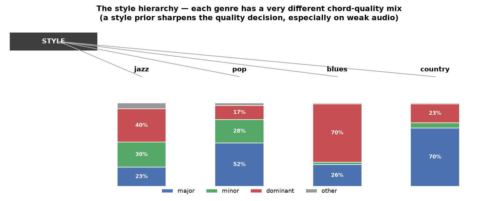

# Building Harmonia: when the priors earn their keep (Part 7)

*Seventh in a series. [Part 6](06-teaching-the-model-to-hear.md) trained a model
that closed two-thirds of the audio→chord gap and pinned the remaining problem on
one note: the third. This part is about the musical priors — the key, the chord
progressions, the style — and a result that looked like a dead end until I changed
the audio underneath it.*

## The prior that predicts the note you can't hear

If the whole problem is hearing the third (major vs minor), there's an obvious
piece of knowledge that decides the third *without hearing it*: the key. In C
major, a chord built on D is almost certainly D **minor**, because that's the note
the scale puts a third above D. And the root we already get reliably from the bass.

So I measured it. Deciding the family:

| method | accuracy |
|---|---|
| the key alone (no audio) | 74% |
| the audio alone | 82% |
| **audio + key together** | **88%** |

Of the chords the audio got wrong on its own, the key rescued 77% of them. The
catch — and this became the theme of the whole project — is that the key has to be
a *gentle nudge*, not a rule. Push it too hard and it starts overriding the audio
on the genuinely chromatic chords (a jazz A7 in C major, where the audio correctly
hears the "wrong" note); the sweet spot is a roughly five-to-one trust ratio,
audio to key. Wired into the real pipeline at that low weight, it lifted
major/minor accuracy by six points and fixed a regression that had been open for
three sessions.

## Measuring how much to trust each clue

That five-to-one ratio was the first hint of the right way to think about the whole
system: not "does this clue help?" but "how much should I trust it, and does it
overlap with what I already know?" So I pooled four clues — the audio, the key, the
chord progression, and repeated-section structure — and *fit* the trust weights
from data.

The audio took 66% of the trust; each prior took about 11% — a gentle-nudge ratio,
learned rather than guessed. And when I removed each clue to see what unique
information it carried, a clean picture emerged: the audio is essential (−9 points
without it), the key adds real unique information (−2.4), and progression and
structure were mostly redundant with what the audio and key already said.

## The dead end

Here's where it looked finished, and boring. Every prior I tried added almost
nothing on top of the trained audio model. The key: +0. Progression, done right:
+0.2. Structure stacking: +0.4. I'd built this elaborate Bayesian apparatus and
the data kept saying *the audio already knows*.

Then a collaborator asked the question that turned it around: *these are simple,
clean cases — full chord voicings, one instrument, front and centre. What happens
on a real recording, where the third or fifth or seventh isn't even played, and
the comping is buried under drums and a melody?*

## The priors were never for the easy cases

So I degraded the audio on purpose — dropped chord tones, added other-instrument
noise — and re-measured how much the key prior recovers:

| voicing | audio alone | audio + key | key recovers |
|---|---|---|---|
| full (clean) | 94% | 95% | +0.1 |
| missing 5th | 65% | 89% | **+24** |
| missing 3rd | 66% | 76% | +10 |
| root + color only | 34% | 65% | **+32** |

There it was. On a complete voicing the key prior is worthless. On a degraded one
it recovers **ten to thirty points**. The reason is almost tautological once you
see it: *a note that isn't in the signal cannot be recovered by any amount of
listening — only a prior can supply it.* The whole time the priors had looked
useless, it was because the test material was too easy. The priors are insurance,
and I'd only been driving in fair weather.

This reframes everything the clean numbers said. "The audio already knows" is true
exactly until the audio doesn't — and on real, multi-instrument, subtly-voiced
music, it often won't. The right design leans on the priors in proportion to how
uncertain the audio is (and the model already outputs a well-calibrated
uncertainty for exactly this). That's the whole Bayesian bet.

## The real test: buried comping

Dropping tones by hand is one thing. So I built proper hard audio — the same
charts, but rendered as separate stems (bass, comping, drums), a synthesized lead
melody on top, mixed with a deliberately uneven balance (loud drums, or a masking
melody, or a quiet sparse comp), plus noise. Then I ran the clean-trained model on
it and measured, sliced by how hard the mix was:

| mix scenario | seventh: audio alone | + key prior |
|---|---|---|
| balanced (easy) | 90.0% | +0.4 |
| loud drums | 74.5% | +0.3 |
| melody masks the comping | 73.4% | **+4.4** |
| sparse, quiet comping | 61.4% | **+9.1** |

The pattern is unmistakable: the harder the mix buries the harmony, the more the
key prior recovers — up to nine points when the comping is barely there. This is
the degradation result again, but now from realistic multi-instrument audio rather
than surgical tone-removal. The priors aren't a rounding error; they're the
difference-maker on exactly the material a real chord recogniser has to face.

## Style is a prior too

One more clue, same logic. A blues, a jazz ballad and a country tune use wildly
different chord vocabularies — I measured it across five thousand-song corpora:

Blues is 70% dominant chords; country is 70% major; jazz leans on dominants and
minors. Knowing the style sharpens the quality guess before you hear a note —
another gentle prior that will matter most exactly when the audio is weak.

[Part 8](08-hierarchies-all-the-way-down.md) is about a pattern that kept
recurring through all of this: the answer, again and again, was a *tree*.
