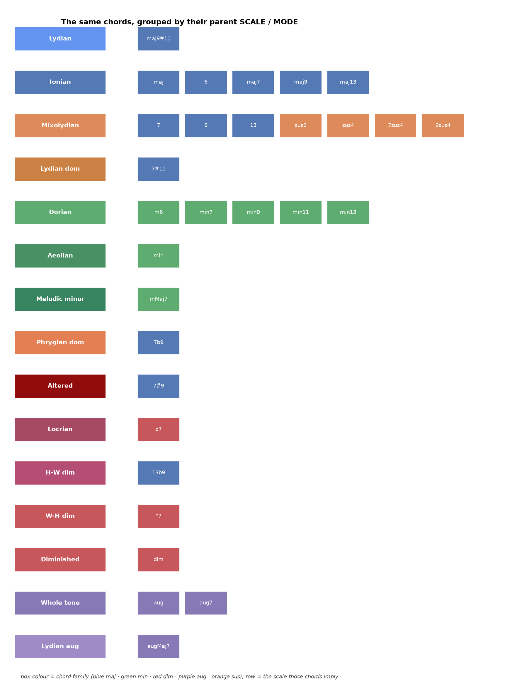
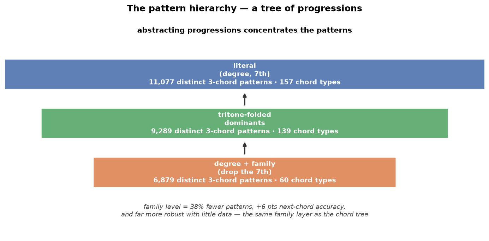

# Building Harmonia: hierarchies all the way down (Part 8)

*Eighth in a series. By now the system had a trained audio model
([Part 6](06-teaching-the-model-to-hear.md)) and a set of gentle priors that earn
their keep when the audio is weak ([Part 7](07-when-the-priors-earn-their-keep.md)).
This part is about a shape that kept reappearing, unbidden, in every part of the
problem: the tree.*

## A tree for chords

The first one was forced on me by the numbers. From audio, the chord *family* is
~94% recoverable but the exact chord only ~84%, so the honest output is a tree —
family, then seventh, then exact — reported only as deep as the evidence allows.

The nice property is that the model can output a *calibrated* confidence (when it
says 0.95, it's right 96% of the time), and that confidence drives how far down the
tree it descends. Confident: "Cmaj7." Unsure: "C major." Never a confident lie.

And each leaf carries one more piece of theory — the scale it draws from. The same
tree, read the other way, is a map of chord-scales: every chord implies a mode, and
grouping the chords by that mode shows which ones share a parent scale (Mixolydian,
it turns out, hosts both the dominant chords and the sus chords):

## A tree for progressions

Then a collaborator pushed the idea somewhere I hadn't expected: if chords form a
tree, don't *progressions* form one too? A ii-V-I and its tritone-substitute
ii-bII-I are the same functional pattern — so at some level of abstraction they
should collapse into one, exactly like Cmaj7 and C7 collapse into "C-family."

I tested it, and the honest answer was more interesting than a clean win. The
abstraction *works* — it correctly merges the substitute progressions, shrinks the
vocabulary of three-chord patterns, and helps most when data is scarce:

But the biggest lever wasn't the tritone substitution I'd gone looking for — those
are rare in *written* lead sheets (they're a performance choice). The biggest lever
was one level up: dropping the seventh and working at the *family* level, which cut
the distinct patterns by 38% and lifted next-chord prediction by six points, and
stayed robust with almost no data.

Which is the same family level as the chord tree. The abstraction that best
describes a single chord is also the best alphabet for describing a *sequence* of
them. One hierarchy, doing two jobs.

## A tree for styles

And a third, from the same instinct. Genres are a hierarchy — a broad style
(jazz, blues, country) with finer feels underneath (swing, bossa, ballad) — and
each level constrains the chord vocabulary:

Blues lives on dominant chords; country on major ones. A hierarchical style prior
sharpens the quality guess before a note is heard — and, per Part 7, will matter
most on exactly the weak, real-world audio where the priors earn their keep.

## The pattern behind the pattern

Three different sub-problems — naming a chord, learning a progression, encoding a
style — and the same structure fell out of each one: a coarse, robust level that
you can almost always trust, refining into finer levels you use only when the
evidence supports them. It's the same principle as the whole Bayesian design: lean
on the sturdy, general thing, and commit to the specific, fragile thing only when
you've earned the right to.

That's not a coincidence about music so much as a coincidence about *evidence under
uncertainty*. When the signal is clean you can afford to be specific; when it's
noisy you retreat to the level that still holds. A tree is just the data structure
that lets you slide along that trade-off gracefully — and building a chord
recogniser for real, messy audio turned out to be one long exercise in learning to
slide the right amount.

*Next: putting it to the test on deliberately hard audio — buried comping, loud
drums, a masking melody — where all of this stops being theory.*
