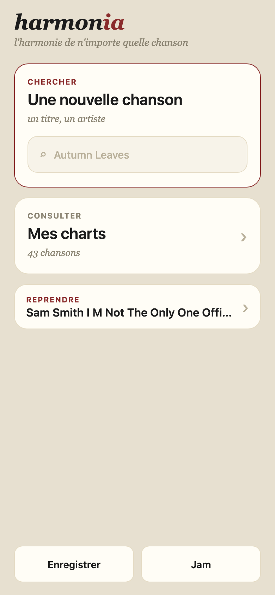
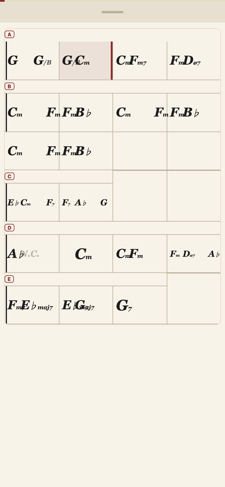
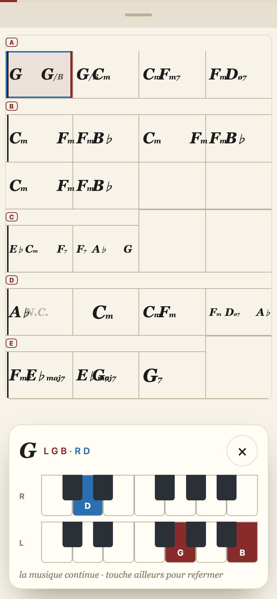
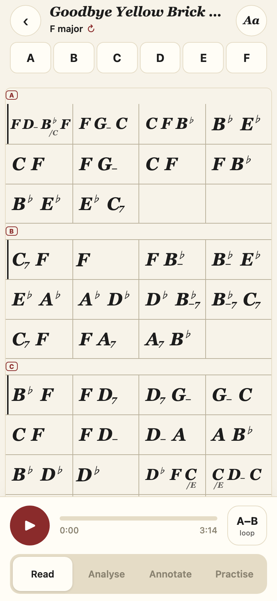
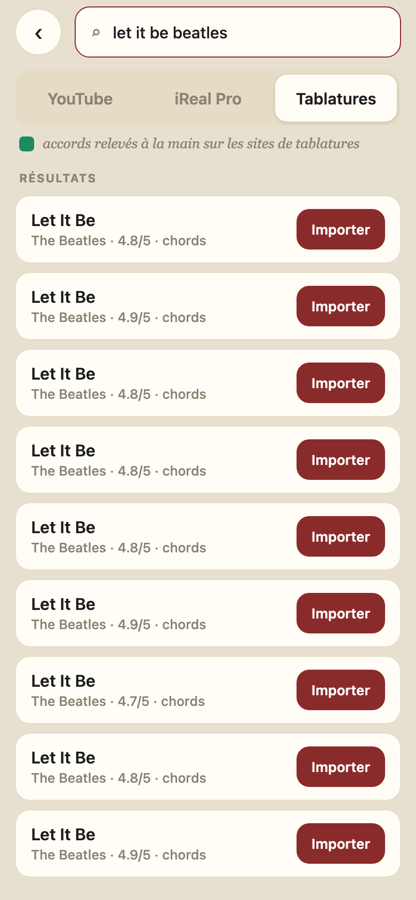

# 2026-08-08 — UI refresh (handoff intégré, branche `feat/ui-refresh-handoff`)

Le handoff `handoff_ui_refresh 2/` (STYLE.md + HANDOFF.md + 5 fichiers js + 1 py)
est intégré en entier dans `harmonia_min/app_shell.html`, `pipeline.py` et
`server.py`. Vérifié sur rendu réel 390 px (Playwright, 15 écrans) : **tous les
audits passent** — aucun bouton sous 44 px sur aucun écran, aucun emoji dans le
fichier, 2 rangées de chrome au-dessus de la grille en Read, 3 en Analyse, une
seule surface FORM en Annotate, et l'écran de chargement ne bouge pas d'un
pixel quand les sections arrivent.

## Ce qui a changé, écran par écran

- **Chart (§1–§3)** : les quatre rangées (app bar, mode bar, légende, strip
  FORM) deviennent **une toolbar** (retour · titre + « F minor · form ↻ » qui
  ouvre le rotor · Aa) + **un dock** en bas (play 56, progression cherchable,
  A–B loop 4 mesures, segmented Read / Analyse / Annotate / Practise). Le
  **form rail** tient la chanson sur une ligne (colonnes flex, plancher 44 px,
  wrap au-delà) et remplace la strip à puces 26 px. En Analyse, une rangée
  « lens » + légende d'une ligne remplace les trois pilules et le pavé de
  texte. Le ribbon Annotate perd sa copie du FORM (le bug « FORM affiché deux
  fois ») et gagne Set bar 1 / Check merges en mots, sans symboles.
- **Prompter (§4)** : accord courant 78 px, son **rôle** en une ligne dessous
  (« sets up the V into… »), les deux prochains accords grisés ; **deux
  claviers empilés, un par main** (main droite en haut, bleue ; gauche en bas,
  bordeaux), fenêtres **fixes pour tout le morceau** (la règle du 2026-08-05 :
  la vue ne se recadre jamais — le brouillon du handoff zoomait par accord, la
  règle a primé) ; play 80 / sauts 60 / loop 52 qui **nomme les mesures**
  (« loop · bars 17–20 ») ; le slider de vitesse devient 0.5× / 0.75× / 1×.
- **Chargement (§5)** : deux segments de progression (l'attente, puis les
  sections), état d'attente sobre, puis **le chart brut entier d'un coup**,
  rendu par le même `loadModel()`/`buildIReal()` que le chart final. Le
  serveur pose `phase` (`listening → decoding → raw → sections → done`) et
  embarque `raw_model` (un vrai ChartModel) dans le job. Bouton « Open the
  chart » à `done` — plus d'auto-navigation.
- **Feuille Aa** : récupère tout ce qui vivait en toggles 9 px — Learn + le
  ladder L1/L2/L3, Follow, le clic métronome, le coach de voicings — plus
  Share. Le coach lui-même vit maintenant DANS le dock, carte sur papier.

## Décisions prises en autonomie (la maquette `.dc.html` n'existe nulle part sur le disque)

1. **« Practise » = 4ᵉ segment du dock** → c'est l'accès au prompter (l'ancien
   bouton-emoji 9 px). Quatre choix, la limite haute du kitSegmented.
2. **STYLE.md prime sur le handoff** quand ils se contredisent, comme STYLE.md
   le demande : le toggle joined/split est à 44 px (le handoff disait 34), le
   rail wrappe dès qu'une colonne passerait sous 44 px (le handoff shrinkait
   jusqu'à 14 runs).
3. **Le grep anti-emoji attrape ♭ et ♯** (U+266D/266F sont dans la plage
   2600–27BF). Ce sont les altérations des accords — la typographie même du
   produit. Tout le reste de la plage a été purgé (✓ ♩ ❚ ⚲ ★ 💡 🧩 🎹 🎞…,
   pause = deux barres CSS) ; ♭/♯ sont l'unique exception, assumée.
4. **En Annotate, les accords de la grille sont des boutons** : zone de tap
   étendue à 44×44 (le glyphe ne bouge pas). Dans une mesure à 3-4 accords les
   zones se recouvrent — physiquement inévitable à 390 px, l'ordre DOM arbitre.
5. **L'acceptance « raw_model et modèle final identiques (bar, beat, t0/t1) »
   est insatisfiable au pied de la lettre** dès que le repli tourne : le fold
   réécrit des accords (c'est son travail) et écrit chaque lettre une fois.
   Ce qui tient exactement, mesuré sur This Love : `barGrid` et `nBars`
   **identiques**, et chaque slot partagé à moins d'une demi-trame musx
   (23 ms) — le final pose ses accords SUR les temps de la grille partagée.
   Aucune cellule ne bouge (vérifié au pixel sur l'écran de chargement).
   Sous `HARMONIA_RAW_CHART=1`, brut = final trivialement.

## Deux bugs du handoff corrigés au passage

- `form_rail.js` comparait `style.borderColor` à un hex — le navigateur
  renvoie du `rgb(...)`, tous les chips auraient été « actifs ».
  `paintFormChip` expose maintenant l'index courant.
- `prompter_keys.js` posait `flex:1` sur l'hôte du clavier **avant**
  `renderHand`, qui réécrit `cssText` et l'efface → claviers à largeur nulle.
  Le flex est reposé après le rendu (le piège était déjà commenté dans
  l'ancien code du prompter).

## Vérification (tout est rejouable)

- `scratchpad` de session : `verify_ui.py` (15 écrans, audit 44 px + rangées
  de chrome + stabilité des cellules) et `test_raw_vs_final.py` (This Love,
  invariance de la grille brut→final). Serveur worktree sur :7799, jamais
  :7771/:7772.
- Job réel sur le fil : `decoding` → `sections` + `raw_model` + 80 bars →
  `done` + 4 sections. Lecture audio réelle : le dock avance, une seule
  cellule allumée, zéro erreur JS ; A–B loop opérationnel.

## Second passage (retours de Louis, même nuit)

1. **Section vide de tête = intro.** Une première section sans accords (reps=1)
   est renommée « intro », cachée de la grille en Read (gardée en
   Analyse/Annotate pour rester corrigeable), gardée dans le rail ; les lettres
   suivantes se décalent pour que la première vraie section lise A. Vérifié sur
   un chart de test A(vide) B C D E → rail « intro A B C … ».
2. **Notation compacte : la basse du slash chord** passe en bas à droite, sous
   l'accord — la convention classique — au lieu de flotter à mi-hauteur.
3. **Ribbon Annotate purgé**, vérifié contre les routes du serveur : « Pool two
   passes » (POST /api/reinfer est un alias du rescoreur de verrous — un merge
   reçoit un no-op correct), « Bar suggestions » et « Section suggestions »
   (endpoints inexistants ici) sont partis ; restent « Set bar 1 » (the grid) et
   « Check merges » (the sections), en cases légendées. La machinerie d'overlay
   dort dans le code pour le jour où les endpoints exista.
4. **Set bar 1 refait in-app** : une sheet avec la bande façon practise
   (accords, temps, barres), synchronisée à l'audio, marqueur « BAR 1 » fixe ;
   on drague la bande, « Bar 1 starts here » poste `/api/bar1/<file>` — le
   pipeline prend la PHASE du temps marqué (rien n'est coupé, l'avant-marque
   devient l'intro) et le rebuild revient par l'écran de chargement.
5. **Practise : deux réglages séparés** — « Two hands / One hand » choisit le
   VOICING (basse à gauche + formes à droite, vs accord complet dans une main,
   nouvelle cascade bass-in-hand) ; « Two keyboards / One keyboard » choisit
   l'AFFICHAGE (visible seulement à deux mains).
6. **Boucle v2, latence attaquée aux deux endroits** : l'engagement roule sur
   l'élément audio DÉJÀ en cours (zéro démarrage) ; au wrap, le standby démarre
   MUET 150 ms avant la barre, horloge alignée, et le passage n'est qu'un
   volume 1↔0 — plus aucun play()/seek sur la frontière ; la latence de
   démarrage réelle est mesurée à chaque tour et réinjectée (adaptatif, borné
   80 ms). Bouton de réglage d'oreille : `localStorage.harmLoopEpsMs`
   (défaut 6 ms ; positif = croisement plus tôt). Testé 11 s de boucle : reste
   dans la phrase, zéro erreur.

## Lot 2 (delta2, même jour) — les écrans suivants

Le second handoff de l'agent de design (`handoff_ui_refresh_delta2/`) est
intégré en entier : les **7 contrôles d'acceptance du DELTA passent** sur le
rendu réel 390 px (verify_delta2.py, worktree :7799).

- **§6 Lecture immersive** : en lecture Read, les bandeaux s'effacent après
  2,6 s sans interaction — jamais en Annotate. Une barre de progression de
  3 px + une poignée VISIBLE les remplacent ; trois gestes les ramènent
  (poignée, glissé vers le bas, tap hors accord). Nouveau réglage Aa
  « Piano chords » (never / on tap / follow) : **follow EST l'ancien Voicing
  coach** (migration harmCoach incluse — un seul réglage, pas deux) ; « tap »
  fait monter une carte de voicing deux-claviers PAR-DESSUS la grille sans
  couper l'audio. « Mêmes cellules, plus hautes » : seule la hauteur des
  rangées grandit (56→67 px à 390) — un premier essai grossissait aussi les
  glyphes et recréait le chevauchement des barres denses en notation normale.
- **§7 Typographie serrée** (écriture compacte) : dès 2 accords la barre les
  **empile à gauche** à écart fixe (le layout d'iReal — l'abscisse ne dit plus
  le temps), qualité en indice tucké, tailles 30/25/22/19 px, plancher dur
  19. La basse du slash chord pend en **absolu** sous l'épaule droite (la
  convention classique de Louis, round 2) — en flux elle poussait le voisin
  hors de la cellule (3 débordements mesurés sur Goodbye Yellow Brick Road) ;
  même correction pour le slot ♭ fantôme (largeur 0, il ne garde que
  l'assise). Un accord à beat non entier garde la grille proportionnelle.
- **§8 Accueil deux portes** : Chercher (champ dans la carte) / Mes charts /
  Reprendre — Training mode et Section cleanup sortent de l'accueil (les
  écrans restent routables). « Mes charts » : filtre, dossiers avec compteur
  (un chart = au plus UN dossier, un classeur pas des tags), feuille
  « Ranger », et une feuille artiste/titre (le titre YouTube ment souvent) qui
  poste `/api/chart-meta/<file>`. La suppression de l'ancien Edit est gardée.
- **§9 Recherche trois sources** : YouTube (défaut) / iReal Pro / Tablatures,
  une légende dit ce que chaque source implique. La carte entière est la
  cible ; la pastille est une étiquette sans onclick. **La recherche
  Ultimate Guitar est branchée pour de vrai** (`/api/tab-search`, façade
  curl_cffi sur `harmonia.tab_fetcher` — 9-12 résultats réels vérifiés) ;
  l'IMPORT répond honnêtement qu'il n'est pas branché : une tab n'a ni
  mesures ni temps, il faudra l'aligner sur l'audio (le DELTA la disait
  « façade », c'est faux pour l'import — signalé, pas maquillé).
- Serveur : `/api/chart-meta` + `/api/folders` (sidecars état), `artist`
  servi dans `/api/library`, `/api/tab-search`, `/api/tab-import`.

Écarts au handoff, chacun raisonné dans le code : basse sous l'accord gardée
contre le brouillon inline du delta2 (décision explicite de Louis, round 2) ;
suppression gardée en Modifier ; scroll infini YouTube gardé (demande Louis
2026-08-04) ; correctif chart_chrome du lot 2 déjà en place chez nous depuis
le lot 1 (min-height 44 + marges négatives). Détail sans gravité : les
nouveaux écrans du designer sont en français, le chart reste en anglais — la
langue de l'app est désormais mixte, à trancher un jour globalement.

Note de déploiement (2026-08-08) : au moment du merge dans l'arbre partagé,
une autre session avait 18 lignes NON commitées dans app_shell.html (orbes du
compass, zone annotation). Leur diff a été sauvegardé, le fichier restauré,
le merge fait, puis leur diff reposé à l'identique (vérifié octet par octet,
`/private/tmp/orbs_wip_2026-08-08.patch` en garde une copie). Rien perdu.

## Ce que ce changement ne règle PAS

- L'éditeur (Compass/Guide/By hand), record et jam n'ont pas été redessinés —
  seuls leurs contrôles sous 44 px ont été remontés au plancher et leurs
  bordures pointillées passées en trait plein. (La bibliothèque, elle, l'est
  depuis le lot 2 — accueil deux portes + Mes charts en dossiers.)
- L'import de tablatures (bouton « Importer » de la source Tablatures) répond
  un message honnête au lieu d'ouvrir un chart — il faut construire
  l'alignement tab→audio d'abord.
- Les dossiers vivent en localStorage (copie serveur en write-through) — pas
  encore synchronisés entre appareils.
- Le coach garde ses cinq styles mais a perdu son panneau brun sombre ;
  l'ancien accès en un tap (transport) devient deux taps (Aa → Voicing coach).
- Les couleurs propres or/violet des deux outils de suggestions (précisions
  très différentes, ~85-92 % vs ~45-55 %) sont remplacées par le kitButton
  unique — la différence de fiabilité n'est plus dite QUE par le texte.
- Pas testé sur un vrai iPhone — le chemin audio iOS (blob-swap, watchdog…)
  n'a pas été modifié, mais la règle du projet reste : vérifier sur l'appareil.
