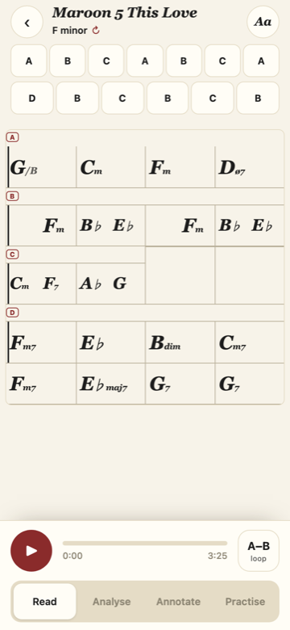
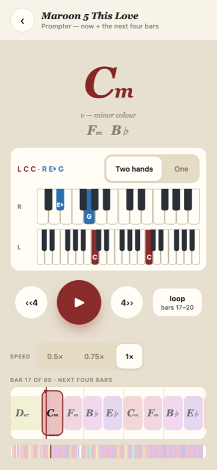
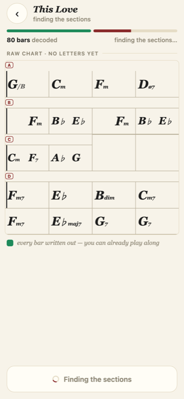

# 2026-08-08 — UI refresh (handoff intégré, branche `feat/ui-refresh-handoff`)

Le handoff `handoff_ui_refresh 2/` (STYLE.md + HANDOFF.md + 5 fichiers js + 1 py)
est intégré en entier dans `harmonia_min/app_shell.html`, `pipeline.py` et
`server.py`. Vérifié sur rendu réel 390 px (Playwright, 15 écrans) : **tous les
audits passent** — aucun bouton sous 44 px sur aucun écran, aucun emoji dans le
fichier, 2 rangées de chrome au-dessus de la grille en Read, 3 en Analyse, une
seule surface FORM en Annotate, et l'écran de chargement ne bouge pas d'un
pixel quand les sections arrivent.

## Ce qui a changé, écran par écran

- **Chart (§1–§3)** : les quatre rangées (app bar, mode bar, légende, strip
  FORM) deviennent **une toolbar** (retour · titre + « F minor · form ↻ » qui
  ouvre le rotor · Aa) + **un dock** en bas (play 56, progression cherchable,
  A–B loop 4 mesures, segmented Read / Analyse / Annotate / Practise). Le
  **form rail** tient la chanson sur une ligne (colonnes flex, plancher 44 px,
  wrap au-delà) et remplace la strip à puces 26 px. En Analyse, une rangée
  « lens » + légende d'une ligne remplace les trois pilules et le pavé de
  texte. Le ribbon Annotate perd sa copie du FORM (le bug « FORM affiché deux
  fois ») et gagne Set bar 1 / Check merges en mots, sans symboles.
- **Prompter (§4)** : accord courant 78 px, son **rôle** en une ligne dessous
  (« sets up the V into… »), les deux prochains accords grisés ; **deux
  claviers empilés, un par main** (main droite en haut, bleue ; gauche en bas,
  bordeaux), fenêtres **fixes pour tout le morceau** (la règle du 2026-08-05 :
  la vue ne se recadre jamais — le brouillon du handoff zoomait par accord, la
  règle a primé) ; play 80 / sauts 60 / loop 52 qui **nomme les mesures**
  (« loop · bars 17–20 ») ; le slider de vitesse devient 0.5× / 0.75× / 1×.
- **Chargement (§5)** : deux segments de progression (l'attente, puis les
  sections), état d'attente sobre, puis **le chart brut entier d'un coup**,
  rendu par le même `loadModel()`/`buildIReal()` que le chart final. Le
  serveur pose `phase` (`listening → decoding → raw → sections → done`) et
  embarque `raw_model` (un vrai ChartModel) dans le job. Bouton « Open the
  chart » à `done` — plus d'auto-navigation.
- **Feuille Aa** : récupère tout ce qui vivait en toggles 9 px — Learn + le
  ladder L1/L2/L3, Follow, le clic métronome, le coach de voicings — plus
  Share. Le coach lui-même vit maintenant DANS le dock, carte sur papier.

## Décisions prises en autonomie (la maquette `.dc.html` n'existe nulle part sur le disque)

1. **« Practise » = 4ᵉ segment du dock** → c'est l'accès au prompter (l'ancien
   bouton-emoji 9 px). Quatre choix, la limite haute du kitSegmented.
2. **STYLE.md prime sur le handoff** quand ils se contredisent, comme STYLE.md
   le demande : le toggle joined/split est à 44 px (le handoff disait 34), le
   rail wrappe dès qu'une colonne passerait sous 44 px (le handoff shrinkait
   jusqu'à 14 runs).
3. **Le grep anti-emoji attrape ♭ et ♯** (U+266D/266F sont dans la plage
   2600–27BF). Ce sont les altérations des accords — la typographie même du
   produit. Tout le reste de la plage a été purgé (✓ ♩ ❚ ⚲ ★ 💡 🧩 🎹 🎞…,
   pause = deux barres CSS) ; ♭/♯ sont l'unique exception, assumée.
4. **En Annotate, les accords de la grille sont des boutons** : zone de tap
   étendue à 44×44 (le glyphe ne bouge pas). Dans une mesure à 3-4 accords les
   zones se recouvrent — physiquement inévitable à 390 px, l'ordre DOM arbitre.
5. **L'acceptance « raw_model et modèle final identiques (bar, beat, t0/t1) »
   est insatisfiable au pied de la lettre** dès que le repli tourne : le fold
   réécrit des accords (c'est son travail) et écrit chaque lettre une fois.
   Ce qui tient exactement, mesuré sur This Love : `barGrid` et `nBars`
   **identiques**, et chaque slot partagé à moins d'une demi-trame musx
   (23 ms) — le final pose ses accords SUR les temps de la grille partagée.
   Aucune cellule ne bouge (vérifié au pixel sur l'écran de chargement).
   Sous `HARMONIA_RAW_CHART=1`, brut = final trivialement.

## Deux bugs du handoff corrigés au passage

- `form_rail.js` comparait `style.borderColor` à un hex — le navigateur
  renvoie du `rgb(...)`, tous les chips auraient été « actifs ».
  `paintFormChip` expose maintenant l'index courant.
- `prompter_keys.js` posait `flex:1` sur l'hôte du clavier **avant**
  `renderHand`, qui réécrit `cssText` et l'efface → claviers à largeur nulle.
  Le flex est reposé après le rendu (le piège était déjà commenté dans
  l'ancien code du prompter).

## Vérification (tout est rejouable)

- `scratchpad` de session : `verify_ui.py` (15 écrans, audit 44 px + rangées
  de chrome + stabilité des cellules) et `test_raw_vs_final.py` (This Love,
  invariance de la grille brut→final). Serveur worktree sur :7799, jamais
  :7771/:7772.
- Job réel sur le fil : `decoding` → `sections` + `raw_model` + 80 bars →
  `done` + 4 sections. Lecture audio réelle : le dock avance, une seule
  cellule allumée, zéro erreur JS ; A–B loop opérationnel.

## Ce que ce changement ne règle PAS

- La bibliothèque, l'éditeur (Compass/Guide/By hand), record et jam n'ont pas
  été redessinés — seuls leurs contrôles sous 44 px ont été remontés au
  plancher et leurs bordures pointillées passées en trait plein.
- Le coach garde ses cinq styles mais a perdu son panneau brun sombre ;
  l'ancien accès en un tap (transport) devient deux taps (Aa → Voicing coach).
- Les couleurs propres or/violet des deux outils de suggestions (précisions
  très différentes, ~85-92 % vs ~45-55 %) sont remplacées par le kitButton
  unique — la différence de fiabilité n'est plus dite QUE par le texte.
- Pas testé sur un vrai iPhone — le chemin audio iOS (blob-swap, watchdog…)
  n'a pas été modifié, mais la règle du projet reste : vérifier sur l'appareil.
