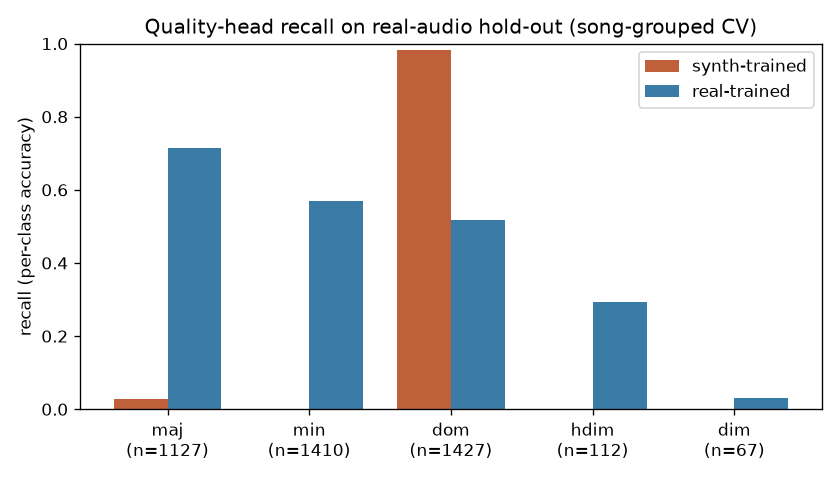
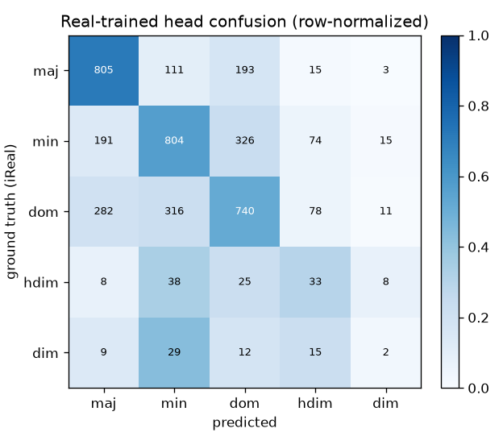
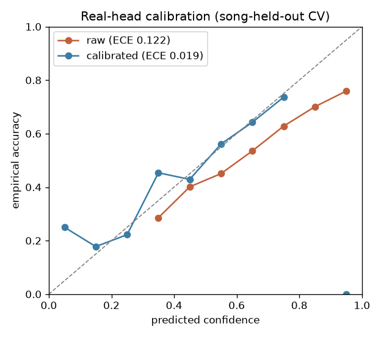

# Mission 2 — Real-audio quality head: results

Retrain the 5-way chord-quality head (maj/min/dom/hdim/dim) on **real-audio** chroma
and measure the lift over a synth-trained baseline. Root is oracle (iReal GT), so
these are quality-conditioned-on-correct-root numbers — an upper bound on the
end-to-end majmin/7ths that the full pipeline achieves with its own root.

## Training data
- Source: `data/cache/yt_corpus/corpus_50.npz` — 50 YouTube songs, iReal Pro GT,
  root-shifted 48-D Basic-Pitch chroma (`feat48`). Kept only `match ∈ {exact,family}`
  (trustworthy root+family) and the 5 target classes.
- **Real training set: 4143 segments**, 50 songs.
  Class mix: maj=1127  min=1410  dom=1427  hdim=112  dim=67.
- Synth baseline trained on `audio_chord_features.npz` (MMA renders), `base7` labels
  remapped to the same q5 scheme: 7101 segments
  (maj=1563  min=2127  dom=2838  hdim=408  dim=165).

## Model
- MLP: `Linear(48,128)→LayerNorm→GELU→Dropout(0.3)→Linear(128,64)→LayerNorm→GELU→Dropout(0.3)→Linear(64,5)`.
- AdamW lr 3e-4, wd 1e-4, cosine schedule, class-balanced CE, 200 epochs,
  batch 128, seed 42. Identical architecture for both heads.

## Evaluation protocols
1. **Canonical split** — the 5-song hold-out stored in `quality_head_v1.pt`
   (reproducible with `eval_quality_head.py`). High variance: that hold-out has ~0
   hdim/dim segments.
2. **Song-grouped 5-fold CV** — every song is tested exactly once; the real head is
   retrained per fold, the synth head is fixed. Predictions pooled across folds.
   **This is the headline** (CLAUDE.md rule #5: single splits are hypotheses).

## Headline: synth-trained vs real-trained (song-grouped CV, n=4143)

| metric | synth-trained | real-trained | lift |
|---|---|---|---|
| strict 5-way acc | 0.347 | 0.575 | **+22.9pp** |
| majmin (third-class) | 0.616 | 0.733 | +11.7pp |
| family-or-better | 0.616 | 0.696 | +7.9pp |

Majority-class floor (always predict `dom`, 1427/4143) = **0.344**. The synth head at
0.347 is statistically *at that floor* — on real audio it does not transfer. The
real-trained head clears it by **+23pp**. The more conservative, mechanism-robust
number is the **majmin +11.7pp** (real vs synth, both genuine multi-class predictors on
the third): retraining on real chroma is the clear win regardless of how degenerate the
baseline is.

## Per-class (recall = per-class accuracy), song-grouped CV

Synth-trained:

| class | n | prec | rec |
|---|---|---|---|
| maj | 1127 | 0.407 | 0.029 |
| min | 1410 | nan | 0.000 |
| dom | 1427 | 0.345 | 0.983 |
| hdim | 112 | nan | 0.000 |
| dim | 67 | nan | 0.000 |

Real-trained:

| class | n | prec | rec |
|---|---|---|---|
| maj | 1127 | 0.622 | 0.714 |
| min | 1410 | 0.619 | 0.570 |
| dom | 1427 | 0.571 | 0.519 |
| hdim | 112 | 0.153 | 0.295 |
| dim | 67 | 0.051 | 0.030 |

The synth head is **degenerate on real audio**: it over-predicts `dom` (recall 0.98,
every other class ~0) — i.e. it defaults to the modal synth class rather than reading
the chroma. The real head is a genuine 5-way predictor: maj/min/dom all land at
0.52–0.71 recall. hdim/dim stay weak (rare: 112/67 segments) but move off zero.

## Confusion matrix — real-trained head (row=GT, col=pred), CV

```
          maj   min   dom  hdim   dim
  maj     805   111   193    15     3
  min     191   804   326    74    15
  dom     282   316   740    78    11
  hdim      8    38    25    33     8
  dim       9    29    12    15     2
```




## Calibration (Mission-3-style, self-contained)
Isotonic regression maps the real head's softmax max-prob → P(exact-correct), fit
**song-held-out** (5-fold, no song in both fit and score). This does not depend on the
Mission 1 audio benchmark (which is not yet built — only PROTOCOL.md exists).

| | mean conf | ECE |
|---|---|---|
| raw softmax max-prob | 0.697 | 0.1217 |
| isotonic-calibrated | 0.575 | **0.0191** (PASS <0.05) |

Base accuracy is 0.575; the raw head is over-confident, and isotonic
collapses displayed confidence toward the reliability ceiling.



## Artifacts
- `data/models/quality_head_v1.pt` — real-trained head (canonical split checkpoint).
- `data/models/quality_head_v1_calibrator.npz` — isotonic calibrator (score_kind=quality_maxprob).
- `docs/plots/mission2_accuracy_synth_vs_real.png`, `mission2_confusion_real.png`,
  `mission2_calibration_curve.png`, `mission2_example_predictions.html`.

## Caveats
- Root is oracle here; end-to-end lift is smaller (model root is imperfect).
- hdim/dim are rare (112/67 segments) — their per-class
  numbers are high-variance even under CV.
- The synth baseline is a faithful stand-in (same features/classes) but not the exact
  production `_FamilyClassifier` object; it is trained here to isolate the *training-domain*
  effect with everything else held equal.
