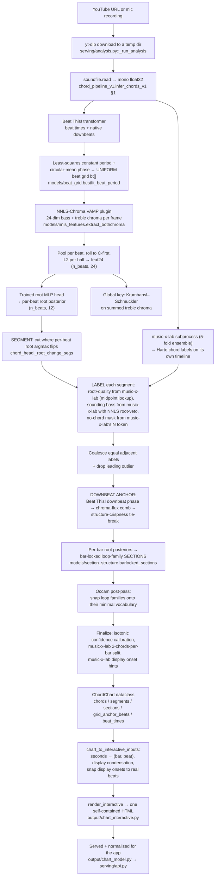

# Harmonia — every brick of the pipeline, end to end

*Written 2026-07-26. Audience: Louis. Everything here was read out of the code;
where the repo's written records disagree with the code, the code wins and the
disagreement is flagged with **⚠ RECORD vs CODE**.*

**Ground rule for this document:** maths, DSP and jazz theory are used freely
(chroma vectors, Viterbi, posteriors, Krumhansl–Schmuckler, ii–V–I, sounding
bass, tritone sub). What is *never* used without being spelled out is
**project-internal shorthand** — every internal name is decoded on first use and
listed in the decoder ring below.

---

## 0. Decoder ring — the internal names, in plain words

| Internal name | What it actually is |
|---|---|
| **music-x-lab** (often written `musx`) | An **external** pretrained chord-recognition model (Chen & Su, ISMIR 2019, "Large-Vocabulary Chord Recognition"). Not ours. Lives as a git clone; we shell out to it as a **subprocess** and cache its output. On the shipped path it supplies the chord **identity** (root + quality) and the sounding bass. |
| **NNLS-Chroma** (often `nnls24`, `nnls_features`) | Mauch & Dixon's NNLS-Chroma **VAMP plugin** — a non-negative-least-squares deconvolution of the log-spectrum against a harmonic dictionary, which suppresses upper partials before folding to pitch classes. It emits a 24-dim vector per frame: 12 **bass** chroma + 12 **treble** chroma ("bothchroma"). "24" = those 24 dims. On the shipped path it supplies **where** chords change, plus the fallback identity. |
| **Basic Pitch** (often `bp48`) | Spotify's polyphonic note-transcription model (88 piano-roll pitches, note + onset activations). "48" is a legacy dim count from an old feature-block. **This whole path is DEPRECATED** — it is not what ships. |
| **Beat This!** | Foscarin et al., ISMIR 2024 — a transformer beat + downbeat tracker, MIT-licensed. This is the shipped beat tracker. |
| **the parity net** | A byte-identity regression harness. It freezes the *current* pipeline's own outputs on 8 fixed songs, then re-runs and diffs. It has **no ground truth** and says nothing about correctness — it only answers "did a refactor change behaviour?". |
| **the frozen benchmark** / **frozen parity** | The 8 songs the parity net is frozen on (`harmonia/eval/benchmark_set.py`). Real YouTube audio, no ground truth. |
| **goldens** | The frozen JSON snapshots the parity net diffs against (`harmonia/eval/golden/frozen_parity/*.golden.json`). |
| **brick 0** / **golden/brick0** | A *different*, unrelated thing despite the shared word "golden": the **hand-verified real-audio accuracy benchmark**. 10 files under `golden/brick0/`, 7 with `verified: true`. Chord symbols from iReal Pro, timeline placed on the audio clock offline and frozen, then ear-checked by you. This is the only thing in the repo that answers "is the output *right*?". |
| **pre-coalesce** | The per-segment chord labels *before* adjacent identical labels are merged. A named intermediate because the parity net freezes it. |
| **coalesce** | Merging adjacent segments carrying the same label into one span, summing duration-weighted confidence. |
| **the Occam post-pass** | A post-inference simplification: find the song's own repeating chord vocabulary and snap decode noise onto it, keeping only deviations that survive a Bayes-factor test. Uses only the song's own structure — no corpus language model. |
| **PORT / Phase 1..7 / STEP A, B** | Labels from the 2026-07-21→26 refactor. They describe *code moves*, not musical stages. Phase 3 = the chord stage got its own module; Phase 6 = the web server got split up; Phase 7 = ~83 scattered feature-extraction call-sites got routed through one function. |
| **brick** (generic) | This project's word for "a self-contained module with a kill-switch and a measured on/off delta". Most bricks are **default-OFF**. |
| **gate** | Either (a) a threshold that must be passed, or (b) a pass/fail check a change must clear before it ships. Context disambiguates. |
| **the fusion aligner / fusion DBN** | A separate, newer lane: a Bayesian bar-pointer dynamic Bayesian network that fuses harmony + drums + bass + harmonic rhythm to place a *known chart* onto audio. Not yet on the shipped chord path. |
| **iReal Pro** | The chord-chart app. Its `.txt` playlist exports are the highest-trust chord source in the project. |
| **sounding bass** | Since 2026-07-16 the project's root/bass target is the **actually-sounding lowest pitch class**, not the functional root. `C/E` scores `E`, not `C`. |

---

## 1. The one-page map



**The single most important sentence in this document:**
> **NNLS-Chroma decides *where* chords change. music-x-lab decides *what* the chord is.**
> Almost every accuracy question resolves to which of those two you are asking about.

The shipped configuration, verbatim from `harmonia/serving/runtime.py` (lines 69–86)
and `harmonia/eval/accuracy_score.py::SHIPPED_CONFIG`:

```python
feature_frontend  = "nnls24"    # NNLS-Chroma is the acoustic front-end
bass_frontend     = "musx"      # sounding bass from music-x-lab (NNLS vetoes)
quality_frontend  = "musx"      # root + quality from music-x-lab
segment_source    = "nnls"      # boundaries from the NNLS root-argmax flips
beat_backend      = "beatthis"  # Beat This!
beat_period_mode  = "bestfit"   # whole-song least-squares period
```

---

## 2. Brick-by-brick

### Brick 1 — Job orchestration and audio acquisition

**File:** [`harmonia/serving/analysis.py`](../harmonia/serving/analysis.py) (`_run_analysis`)

**One sentence.** Downloads the audio, calls the chord pipeline, renders the
chart, transcodes a playable copy, and streams progress to the UI.

**In → out.** In: a YouTube URL (or a local file from the mic-record route).
Out: a rendered `docs/plots/inferred_<slug>.html` and a job record the front end
polls.

**How it works.** `yt-dlp` writes `<video_id>.<ext>` into a fresh
`tempfile.mkdtemp()`. That naming is load-bearing — every downstream cache is
keyed on the **file stem**, not mtime or content hash, because (a) a fresh temp
dir gives a new mtime every time, defeating an mtime cache, and (b) yt-dlp's
`bestaudio` is *not* byte-deterministic across downloads, defeating a content
hash. The video id is the only stable identifier. See the long docstrings in
[`musx_bass.py::_cache_key`](../harmonia/models/musx_bass.py) and
[`nnls_features.extract_bothchroma`](../harmonia/models/nnls_features.py).

A `progress_cb` callback threads through the whole decode and fires five events
in order: `beats` → `key` → `draft` → per-ensemble-fold `chords` → `sections` →
final `chords`. The **draft** event is a complete chart computed from the pure
NNLS heads *before* the slow music-x-lab subprocess starts, so the UI shows
something in ~5 s instead of ~30 s. Draft and final go through the *identical*
per-segment code path — only the available inputs differ — so they cannot
silently diverge in mechanism.

**Decides vs passes through.** Decides nothing musical. It does decide the
`bar1_offset`: when the bar-locked section pass fired, that pass **owns** the
bar-1 phase and any stale hand-saved offset is discarded (persisted back as 0 so
the serve path does not double-shift an already-anchored chart).

**Weaknesses.** After the job is marked done, a background thread runs a **full
cold Basic Pitch pass** purely to persist a `.npz` that only a future annotator
surface will read (~11–18 s of wasted compute per analysis, off the hot path but
not free). Noted in the code's own comment as a fix for a worse bug — it used to
run *inside* the user-visible wait.

---

### Brick 2 — Audio loading

**Files:** [`harmonia/core/audio.py`](../harmonia/core/audio.py) (canonical);
`chord_pipeline_v1.infer_chords_v1` §1 (what actually runs).

**One sentence.** Read the file, mono-mix, float32, native sample rate.

**In → out.** In: a path. Out: `(y: float32[n], sr: int)` and
`duration_s = len(y)/sr`.

**⚠ RECORD vs CODE.** `core/audio.py` is described as "the single canonical
place for audio I/O", but the shipped path does **not** call it —
`infer_chords_v1` has its own inline `sf.read` + mean-mix (line 3837). The two
are behaviourally identical, so nothing is broken; the canonicalisation is
simply incomplete.

`soundfile` cannot decode `.m4a`, so anything reading from `docs/audio/*.m4a`
must transcode to WAV first. The server transcodes; the parity harness has its
own `decode_to_wav`.

---

### Brick 3 — Beat tracking and the beat grid

**Files:** `chord_pipeline_v1.infer_chords_v1` §2 (lines 3841–3917) — the
orchestration; [`harmonia/models/beat_grid.py`](../harmonia/models/beat_grid.py) —
the estimators; [`harmonia/models/downbeat_anchor.py`](../harmonia/models/downbeat_anchor.py) —
the Beat This! wrapper.

**One sentence.** Track beats with a transformer, then replace the tracked
(jittery) times with a perfectly uniform grid at a least-squares-fitted period
and a circular-mean phase.

**In → out.** In: `(y, sr)`. Out: `bt` — a uniform array of grid times in
seconds, one per beat, from 0 to `duration_s`; plus `tempo_bpm`, `period` (beat
duration in seconds), and `beat_times_raw` (the *real*, non-uniform tracked beats,
carried along for display snapping only).

**How it works.**

1. **Beat This!** (`_get_beatthis`) returns beat times and native downbeats.
   Validated 2026-07-21: tempo-octave correct 78% vs librosa's 65% on POP909
   (88% vs 66% on the hard <80 / >170 BPM subset), beat F1 0.85 vs 0.77. Any
   failure degrades silently to `librosa.beat.beat_track`.
2. **Best-fit period** (`bestfit_beat_period`). A tracker's global tempo scalar
   is essentially the *local median* inter-beat interval; it carries a 0.5–2.3%
   systematic error against the whole-song average, which integrates into
   multi-bar drift by the end of a song. This refits the period as the
   least-squares slope of beat-time against beat-index, with the index assigned
   by cumulatively rounding each gap to the nearest integer multiple of the
   initial period (so a dropped beat advances the index by 2, not 1). Guarded:
   a fit outside ±10% of the tracker's period is rejected — this corrects a
   scalar error, it is not a tempo re-estimator.
3. **Phase** by circular mean: map each beat time to an angle
   `2π·(t mod period)/period`, take `angle(mean(exp(i·θ)))`, convert back to
   seconds. Then `bt = arange(phase, duration_s + period, period)`, with 0 and
   `duration_s` forced in.

**Decides vs passes through.** Decides tempo, period and beat phase for the
whole decode. It explicitly does **not** decide the downbeat — which beat is "1"
is settled much later, in Brick 8.

**Weaknesses.**
- The grid is **rigidly uniform**. It cannot absorb rubato or a ritardando. On
  *Let It Be* the uniform grid drifts ±1.5 s from the real beats by the end.
  Mitigation is display-only: the real tracked beats are carried in
  `ChordChart.beat_times` and the *displayed* `t0/t1` are snapped to them, so
  the playhead tracks the audio while the bar layout stays on the uniform grid.
  The **decode still runs on the uniform grid** — a real, unsolved limitation.
- Tempo-octave lock: the guard rejects a bad refit, but if `period_init` is
  already the wrong octave the fit stays in the wrong octave. `CLAUDE.md`
  documents POP909 song 002 as the canary (true ~64 BPM; librosa says ~129).
- **⚠ RECORD vs CODE.** [`harmonia/stages/beat_grid.py`](../harmonia/stages/beat_grid.py)
  exists and looks like the beat brick, but it is a **stub that raises
  `NotImplementedError`** ("Phase 2: port beat_grid"). The beat grid was never
  ported out of `infer_chords_v1`. Do not go looking for the beat logic there.

---

### Brick 4 — Feature extraction: the abstraction, and which variant actually ships

**File:** [`harmonia/core/features.py`](../harmonia/core/features.py)

**One sentence.** A pluggable "audio path in → cached model activations out"
interface with three declared backends.

**The three backends.**

| Name | What it is | Output type | Status |
|---|---|---|---|
| `bp48` | Basic Pitch (ONNX) → `(frames, 88)` note + onset activations | `ActivationResult` | **DEPRECATED** — still the default kwarg of `infer_chords_v1`, still exercised by the parity net, but not the shipped chord path |
| `nnls24` | NNLS-Chroma VAMP → `(T, 24)` bass\|treble chroma | `NNLS24ActivationResult` | **⚠ dead wrapper — never instantiated anywhere** |
| `musx` | music-x-lab subprocess → Harte chord labels + times | `ChordLabelResult` | **⚠ dead wrapper — never instantiated anywhere** |

**⚠ RECORD vs CODE — read this one carefully.** `FeatureExtractor.create(...)`
is called with `"bp48"` and **only** `"bp48"`, at every one of its call-sites in
`harmonia/`, `scripts/` and `tests/` (verified by grep, 2026-07-26). The shipped
NNLS-Chroma and music-x-lab paths bypass this abstraction entirely and import
`harmonia.models.nnls_features` / `harmonia.models.musx_bass` directly (see
`chord_head.extract_features`, line 236). So the abstraction currently
generalises only the **deprecated** backend. The `NNLS24Extractor` and
`MusxExtractor` classes are correct, tested-by-inspection, and unreached.

**Two shapes, deliberately.** The interface has to carry two genuinely
different kinds of thing: *soft per-frame activations* you can pool to beats,
versus *hard chord labels on their own timeline* that you can only look up. That
is why `pool_to_beats` raises `NotImplementedError` on the base class rather than
pretending music-x-lab produces a feature matrix.

**Pooling semantics.** `ActivationResult.pool_to_beats` sums (bp48 convention)
or means over `[t_start, t_end)`; an empty interval falls back to the single
nearest frame. `NNLS24ActivationResult` overrides this to delegate to the
NNLS-specific pooling (below), because the NNLS features must match their
*training* recipe byte-for-byte.

---

### Brick 4b — The canonical CQT-chroma helper

**File:** [`harmonia/core/chroma.py`](../harmonia/core/chroma.py)

**One sentence.** One place for the `librosa.feature.chroma_cqt` + frame-times +
long-term-average-spectrum normalisation block that had been copy-pasted into
~22 scripts.

**In → out.** In: an already-loaded `(y, sr)` waveform in memory. Out:
`(chroma (12,T), times (T,))`.

**How it works.** Constant-Q transform chroma at `bins_per_octave=36` (3 bins
per semitone) and `hop_length=512`, then optionally **LTAS normalisation**:
divide each of the 12 pitch-class rows by its own long-term mean, so every row
ends with mean ≈ 1. This preserves local dynamics while removing the per-song
spectral tilt that otherwise makes some pitch classes systematically louder
(a floor of `1e-9` keeps near-silent rows from exploding).

**Relationship to Brick 4.** Deliberately a *separate* module:
`core/features.py` is the "path → cached model activations" abstraction;
`core/chroma.py` is the "in-memory signal → plain arrays" helper, with no cache
and no model. Different responsibilities.

**Calibration note (this is the counter-rule to error-pattern #1 in `CLAUDE.md`
being applied correctly).** Before collapsing the two spellings, the defaults
were verified against the installed librosa 0.11.0: `chroma_cqt` really does
default to `bins_per_octave=36` and `hop=512`, so the sites that passed them
explicitly and the sites that passed nothing had *always* been computing the same
geometry.

**Guard rail.** [`tests/test_no_inline_feature_sites.py`](../tests/test_no_inline_feature_sites.py)
fails on any new inline `PitchExtractor` / `librosa.chroma_*` / `librosa.cqt`
site outside an allowlist whose every entry carries a written reason, plus a
fourth test that catches stale allowlist entries.

---

### Brick 5 — NNLS-Chroma front-end and the trained heads

**File:** [`harmonia/models/nnls_features.py`](../harmonia/models/nnls_features.py)

**One sentence.** Run the NNLS-Chroma VAMP plugin, pool it per beat into the
exact feature convention the heads were trained on, and serve per-beat root and
quality posteriors from a small trained MLP.

**In → out.**
- `extract_bothchroma(path)` → `arr (T, 24)` with **index 0 = A**, plus
  `times (T,)` in seconds. Cached to `data/cache/nnls_infer/<stem>.npz`.
- `pool_beats(arr, times, bt)` → `feat (n_beats, 24)`.
- `heads.root_proba(feat)` → `(n_beats, 12)` root pitch-class posteriors.
- `heads.quality_idx(feat, roots)` → `(n_beats,)` index into a 7-way quality
  vocabulary `{maj, min, dom, hdim, dim, aug, sus}`.

**How it works.** NNLS-Chroma solves a non-negative least-squares problem
against a dictionary of harmonic templates before folding to pitch classes,
which is why it suppresses upper partials far better than raw CQT chroma. The
plugin emits 24 dims: a bass-register chroma and a treble-register chroma.

The per-beat feature recipe is **matched byte-for-byte to the training
extractor**, and every step of it is load-bearing:
1. Mean the raw bothchroma over `[t0, t1)` (empty interval → nearest frame).
2. `np.roll` each 12-half by **9** — the plugin's index 0 is A, and the model
   was trained C-first.
3. **L2-normalise each half independently**, then concatenate.

The root head consumes the **absolute** 24-d vector; the quality head consumes
the same vector **rotated so the predicted root sits at index 0** — a deployable
cascade (root first, then quality conditioned on it), which is why quality is
transposition-equivariant by construction.

Bass, on the NNLS side, is **untrained**: `argmax` over the (C-framed) bass half.
Free on all audio; measured 0.776 all / 0.743 on inversions.

**Decides vs passes through.** On the shipped config the root head's output is
used for **segmentation** (where argmax flips → a boundary), for the **bar-level
posteriors** the section pass and Occam post-pass consume, and as the **fallback**
identity where music-x-lab has nothing. It does **not** decide the final chord
label. The bass argmax survives as a **veto** (Brick 6).

**Weaknesses.**
- Requires a native VAMP plugin on `VAMP_PATH` plus the `vamp` Python module —
  not a pip install. Missing → the whole nnls24 path raises and the server falls
  back to the deprecated Basic Pitch chain.
- The stem-keyed cache means a **local** file edited in place under the same name
  reads a stale entry. Clear `data/cache/nnls_infer/` after replacing a local file.
- The heads import their MLP class from `scratchpad/multihead_training.py` via
  `sys.path.insert` — a training-time artefact on the inference path.

---

### Brick 6 — music-x-lab: the external chord identity source

**File:** [`harmonia/models/musx_bass.py`](../harmonia/models/musx_bass.py)
(the module name understates it — it supplies root and quality too, not just bass)

**One sentence.** Shell out to a pretrained external chord-recognition model,
cache its Harte-notation output, and expose per-segment lookups for root,
quality, sounding bass and no-chord.

**In → out.** In: an audio path. Out: `[(t0, t1, "C:maj7/E"), ...]` — Harte
labels on **music-x-lab's own** timeline, cached to
`data/cache/musx_infer/<stem>_submission.lab`.

**How it works.** `subprocess.run([python, "chord_recognition.py", audio, out,
"submission"])` inside the clone directory, located via `HARMONIA_MUSX_DIR`, then
`harmonia/third_party/`, then an ephemeral scratchpad path. It is a **5-fold
ensemble**; the clone was patched to write a fold-numbered sidecar after each
fold, which the progress path polls so the UI can reveal chords refining
fold-by-fold instead of one silent 10–30 s wait.

The four per-segment adapters all work by **midpoint lookup** — find the
music-x-lab span containing `(t0+t1)/2`:

- `root_quality_per_segment` → `(root_pc, sev_h)`, or `(-1, None)` where
  music-x-lab has nothing (caller falls back to the NNLS heads).
- `bass_pc_per_segment` → sounding bass pitch class. Handles all three Harte
  bass spellings: `D:7` → D (root position), `C:maj/3` → E (scale degree),
  `C:maj/E` → E (absolute).
- `no_chord_per_segment` → boolean mask, **True only where music-x-lab wrote an
  explicit `N`/`X`**. Deliberately distinct from the "no overlapping span" case,
  because a real `N` assertion is trustworthy and an absence is not.
- `routed_bass_pc(musx_bass, nnls_bass, root)` — the validated routing rule:
  music-x-lab is primary, but the NNLS bass argmax **vetoes** a music-x-lab
  inversion claim *only when NNLS itself reads root position*. This kills
  music-x-lab's false-positive inversions. Measured on the full 100-song RWC set:
  0.9196 vs music-x-lab alone 0.8999 — **+2.0pp overall, +2.4pp root-position,
  −1.2pp on inversions**.

**Why it is the identity source.** A fair bake-off on RWC (2026-07-17) had
music-x-lab beating the in-house NNLS heads by **+7.3pp root / +13.5pp quality /
+13.9pp joint**. Standalone sounding bass 0.900 all / 0.744 on inversions.

**Decides vs passes through.** Decides the final **root**, **quality** and
(subject to the veto) **sounding bass** of every segment. It does **not** decide
segment boundaries under the shipped config — those come from the NNLS root
flips — which is precisely why its finer timing has to be re-injected later by
two separate post-passes (Brick 8).

**Weaknesses.**
- Slow (~10–30 s per song, 5 folds) and a subprocess, so it is the wall-clock
  bottleneck.
- Its vocabulary is fixed at 17 qualities plus maj/min slash inversions; extended
  jazz qualities collapse.
- Its `N` token is over-emitted on jazz standards — see Brick 12's
  `no_chord_policy`, where **every predicted `N` on the frozen benchmark was
  wrong**.
- The default clone path in the code is an **ephemeral session scratchpad
  directory** (`/private/tmp/claude-501/.../nnls_bass_tools/...`). A fresh
  machine must clone the repo and set `HARMONIA_MUSX_DIR` or the whole identity
  source silently degrades to the weaker in-house heads.

---

### Brick 7 — Global key inference

**File:** [`harmonia/theory/key_profiles.py`](../harmonia/theory/key_profiles.py)
(`infer_key`); called from `chord_head.extract_features`.

**One sentence.** Score the summed treble chroma against the 24 rotated
Krumhansl–Schmuckler profiles as a multinomial log-likelihood.

**In → out.** In: a `(12,)` **raw, unnormalised** pitch-class energy vector
(here: `feat[:, 12:].sum(0)` — the treble half summed over all beats). Out: a
`KeyPosterior` with the full 24-way posterior, a name like `"Eb major"`, and a
confidence.

**How it works.** `log P(chroma | key k) = Σ_i chroma[i] · log(profile_k[i])`,
plus a (uniform by default) log-prior, then argmax. The KS major and minor
profiles are normalised to sum to 1 so each row is a genuine distribution over
pitch classes.

**Why "raw, unnormalised" is asserted so loudly.** The magnitude carries real
information: more observed evidence should produce a *more concentrated*
posterior. An earlier implementation dot-producted two L1-normalised
distributions and treated that bounded correlation as a log-likelihood, which
capped posterior concentration at ~10% relative spread **regardless of input** —
a textbook silent calibration bug (`known_issues.md` #0, error-pattern #1). The
current form is additive in the evidence and sharpens naturally.

**Decides vs passes through.** Decides the displayed key, the tonic pitch class
the section pass uses, and (indirectly) the diatonic reference for the dormant
key-aware bricks. It does **not** touch the chord labels on the shipped path.

**Weaknesses.** One key for the whole song — `ChordChart.modulations` is
**hardcoded empty** on the nnls24 path. A tune with a bridge in another key
(*Close To You*) keeps one key. Documented as the weakest structural link of the
newer inference lane too.

---

### Brick 7b — Local key (the causal hold-until-forced rule)

**File:** [`harmonia/theory/local_key.py`](../harmonia/theory/local_key.py)
(`continuity_scale_track_v2`)

**One sentence.** Walk the chord sequence left to right, **hold** the current
diatonic collection until a chord's tones no longer fit it, then jump to the
nearest collection on the circle of fifths that does.

**In → out.** In: a list of iReal tokens (`"C-7"`, `"F7"`, `"Bb^7"`) plus a home
key seed. Out: one `{tonic, mode, name}` per chord.

**How it works.** For each chord, extract its core tones. If they sit inside the
current collection, keep it — this is the whole point: a local key is a
*continuity*, never a per-chord re-estimate. If they do not, enumerate every
collection that does fit, rank by circle-of-fifths distance from the current one,
break ties by a lookahead window, then by tonic index.

The v2 refinement: a collection accepts a chord if its tones fit the **natural,
harmonic, or (surgically) melodic minor** colour of that collection. This stops a
minor key's own V7 (raised 7th — D7 in G minor) or i6 (raised 6th — Gm6) from
reading as a modulation. That was the root cause of the *Autumn Leaves*
oscillation where v1 flapped Bb→G→F across a static G-minor loop. Measured on the
iReal section-key oracle: accuracy 54.1% → 55.3%, modulated-recall 23.7% → 27.7%.

**Causality.** The function *signature* defaults to `lookahead=2`, but the
**display path calls it with `lookahead=0`** (`chart_interactive.py` line 289) —
strictly causal, the key described from the past only. The chart's JavaScript
carries a hand-ported copy of the same algorithm and console-logs a divergence
warning if it disagrees with the Python track baked into the payload; the Python
track is the single source of truth.

**Weaknesses.** ~55% accuracy against the oracle — it is a colouring/analysis aid,
not a reliable modulation detector. It is display-side only; it does not feed the
chord decode.

---

### Brick 8 — THE CHORD STAGE

**File:** [`harmonia/stages/chord_head.py`](../harmonia/stages/chord_head.py)
(`NNLS24ChordHead`) — **since 2026-07-26 this is the sole implementation.**
`chord_pipeline_v1._infer_nnls24` is now a 64-line adapter that builds a
`ChordHeadConfig` and calls `run_full`.

This is the biggest brick, so it is broken into its eight sub-steps.

#### 8.1 Features (`extract_features`)
Cached NNLS bothchroma → `pool_beats` → root head → `infer_key`. Emits the
`key` progress event early (~4–6 s), long before music-x-lab starts.

#### 8.2 Segmentation (`_root_change_segs`)
```python
pred = beat_proba.argmax(1)
cuts = [0] + [b for b in range(1, n) if pred[b] != pred[b-1]] + [n]
```
**Cut wherever the per-beat root argmax changes.** That is the entire mechanism.
No stay-cost, no HMM, no minimum duration — unlike the deprecated Basic Pitch
path, which had an HMM transition prior.

Two consequences, both measured:
- It **over-segments**: on POP909, ~30% of these boundaries are spurious, and
  ~77% of the spurious ones sit on weak off-downbeat positions.
- It **under-segments fast harmonic rhythm**: a chorus changing every 2 beats
  collapses into one 4-beat segment, and then the midpoint lookup keeps only the
  middle chord. This is exactly what step 8.7 exists to undo.

Over-segmentation is largely harmless because coalescing (8.4) merges
same-label neighbours back. Under-segmentation is *not* harmless — it destroys
information.

An opt-in alternative exists (`segment_source="musx"`): use music-x-lab's own
change times snapped to the nearest beat, whose boundary-F1 against ground truth
on RWC is 0.90 at 0.5 s tolerance. **Not the shipped default.** Any failure
degrades silently to the NNLS boundaries.

Small dead-weight note: `_fit_harmonic_grid(beat_proba)` — which estimates
whether the song's harmonic rhythm sits on a 2-beat or 4-beat grid, from how
often consecutive 2-beat windows share an argmax root (stability > 0.65 → 4) —
is still computed here but its result is **only logged**. Segmentation uses the
raw argmax flips regardless.

#### 8.3 Per-segment labelling (`_label_segments`)
For each segment `[s, e)`:
1. `p_seg = beat_proba[s:e].sum(0)`; `nnls_root = argmax(p_seg)`.
2. `seg_feat = feat[s:e].mean(0)`.
3. If music-x-lab supplied `(root, quality)` at the midpoint → **use it**;
   confidence = `p_seg[root] / p_seg.sum()` (i.e. **NNLS's confidence in
   music-x-lab's root** — worth noticing).
4. Else fall back to the NNLS root argmax + the cascade quality head.
5. **Fifth correction** (`_fifth_corrected_quality`): a min7↔hdim7 / min↔dim
   tie-break on the *direct* fifth-bin evidence. Compare treble energy at
   `root+7` (perfect 5th) vs `root+6` (flat 5th); flip only if the louder one
   exceeds a minimum energy of 0.12 **and** the ratio exceeds 1.3 **and** it
   points the opposite way from the current label. Otherwise abstain.
6. Sounding bass: `routed_bass_pc(musx_bass, nnls_argmax_bass, root)`.
7. Label = `"{ROOT}:{quality}"`, plus `"/{BASS}"` iff `bass_pc != root`.

Segments flagged no-chord short-circuit to label `"N"`, confidence 0.

#### 8.4 Coalesce + leading-outlier drop
`_coalesce_labeled` merges adjacent identical labels, accumulating
`conf·duration` and `duration` so the final confidence is a **duration-weighted
mean**. `_drop_leading_outlier` removes a spurious leading chord (pre-song video
noise): only the very first span, only if it starts at t≈0, lasts under 1.2
beats, has raw confidence < 0.5, and the next chord starts within 4 beats. The
dropped span's time is absorbed into its successor.

#### 8.5 No-chord gating
Two sources, in strict priority:
- **Primary:** music-x-lab's explicit `N`/`X` token (trustworthy).
- **Fallback, only when music-x-lab supplied no root/quality:**
  `_nnls_no_chord_segs` — a raw-energy gate. A segment is `N` when its mean raw
  **treble** chroma energy falls below `0.35 ×` the song-median beat energy.
  Deliberately energy-only: a *flatness* gate was measured and rejected (an
  intro's flatness 0.49 did not separate from body content's 0.54), so only the
  ~2× energy drop is reliable.

#### 8.6 Downbeat anchor + sections (`_section_anchor_pass`)
This is where "which beat is the 1" is finally decided. The chain:

1. **Beat This! downbeat phase** (`sota_downbeat_phase`, default ON). Its
   confidence signal is *not* the model's own peak probability — that was
   screened and rejected (0.97 on clean pop vs 0.90 on rubato jazz: barely
   separated, because peak-picking always finds *a* locally-confident peak). The
   signal that works is the **regularity of inter-downbeat spacing**: ~97% of
   intervals within 15% of the median on a confidently-tracked song, vs ~30% on a
   rubato jazz performance.
2. If that abstains → **chroma-flux comb**: build a 1-D harmonic-change novelty
   `d(t) = ‖Δ treble-chroma‖₂`, fold it modulo the bar length, take the peak.
   Content-derived, so it is reproducible across re-downloads (two fresh yt-dlp
   pulls → correlation 1.000, phase 0 ms), unlike raw tracker beat times.
3. If the comb is weak (peak/runner-up ratio < 1.05) → **structure-crispness
   tie-break** on the per-beat root posteriors.
4. Optional (default OFF) native per-downbeat bar grid.

Then: pool the per-beat root posteriors into **per-bar 12-d posteriors** at the
chosen anchor, and run `barlocked_sections`
([`harmonia/models/section_structure.py`](../harmonia/models/section_structure.py)).

**Why sections are symbolic, not acoustic.** A premise check on 8 genuine AABA
standards found the bridge is correctly less similar to A than the two A's are to
each other on the **chord** self-similarity matrix (+0.05…+0.11 on 6/8 tunes;
chord-SSM beat acoustic-SSM 7/8), while on the acoustic (Basic Pitch) SSM the
same bridge-contrast is ~0 (±0.003). Across 371 AABA tunes the bridge is the
odd-one-out 85% of the time, mean margin +0.08 — real but weak, so the detector
leans on the form-length prior rather than a novelty peak.

`barlocked_sections` then: derives the song's own loop period from the bar-level
lag-recurrence profile; strips a leading **intro** (bars whose content does not
recur ≥2 bars later); **mean-centres** the per-bar posteriors so a chord shared
by both loops (the F#m7 common to two Mayer Hawthorne loops) stops dominating
and the discriminative content wins; k-means clusters bars into loop families
with a bias toward fewer families; takes **maximal contiguous runs** as sections;
absorbs runs shorter than 2 loop units (turnarounds) into the neighbour they
cadence toward; snaps every boundary to the loop-unit grid.

If the symbolic pass collapses to a single label it returns `[]` — that *is* the
defer signal — and `_section_fallback` runs the librosa Laplacian spectral
clustering detector (McFee & Ellis 2014), but keeps the librosa result only if it
is itself non-degenerate.

#### 8.7 Occam post-pass (`occam_compress_bars` / `_apply_occam_to_coalesced`)
**Default ON.** Kill-switch `HARMONIA_OCCAM_POSTPASS=0`.

Your own principle, implemented: after inference, a parallel pass finds the
simplest pattern that explains the observations. Per contiguous loop family:

1. Guard: ≥ 8 non-`N` bars, else abstain.
2. Rank roots by pooled posterior mass over the whole family (a √N denoising —
   pooling over repeats is the win). Grow a vocabulary greedily until ≥65% of
   bars have their argmax root inside it, capped at 4 roots. If 4 roots still
   miss 65% coverage → **not a simple vamp → abstain**. This coverage gate is
   what protects genuinely through-composed songs.
3. Per vocabulary root, the dominant quality is the majority among its bars
   (collapses maj/maj7 wobble to the family consensus).
4. Re-emit each bar. A bar whose root is in the vocabulary is snapped. A bar
   whose root is *not* gets a per-bar **Bayes factor**:
   `log-odds = conf_weight · conf · [log post[b, r_own] − log post[b, r_snap]] + log prior-odds`,
   keep the bar's own chord iff `> 0`. The likelihood ratio is weighted by the
   bar's **calibrated** confidence, so an uncertain bar defers to the pattern
   while a confident divergent bar keeps its own harmony. The prior-odds term
   starts from the corpus base off-vamp rate of 0.38 (pop iReal ground truth) —
   off-vamp chords are *common*, so the razor stays permissive.

A rigid modulo-P phase pooling was tried first and rejected: real decodes have
chord insertions/deletions that drift the loop phase, so fixed slotting collapses
to the global-mode chord.

**Anti-crush verification:** on clean symbolic ground truth (confidence ≈ 1 → the
likelihood ratio is huge) **100.00% of 25,120 POP909 ground-truth bars are left
unchanged**. It cannot flatten real music.

#### 8.8 Finalize + the two music-x-lab timing repairs

- **`_finalize_chords`** turns spans into output dicts and applies the **isotonic
  confidence calibration** (`nnls24_conf_calibration.npz`). The raw score
  (root-mass share) is well calibrated for the **root alone** (expected
  calibration error 0.015 on RWC) but badly overconfident for the **full
  displayed chord** (root+family joint: ECE 0.145). The piecewise-linear isotonic
  map, fitted on 13.2k RWC blocks with song-grouped out-of-fold ECE 0.014,
  recalibrates the number to "the chord you see is right". `N` spans are clamped
  to confidence 0 — the calibrator was fitted on chord-bearing blocks with no
  reject option, so anything it emits on `N` is meaningless.
- **`_split_collapsed_bars_via_musx`** (default ON) undoes 8.2's
  under-segmentation. It finds each **sustained** run of ≥4 consecutive
  sub-bar music-x-lab segments and re-emits that whole run wholesale from
  music-x-lab's own timing. *Wholesale, not per-bar*, because a per-bar split
  fired unevenly across chorus repeats and desynced them, which collapsed the
  repeat fold. music-x-lab is already the label source, so this only refines its
  own timing — it never invents harmony.
- **`_attach_musx_onset_hints`** (default ON) attaches music-x-lab's change times
  as **display-only** onsets. The `(bar, beat)` layout is untouched; only the
  playhead snap moves.

**Output.** A `ChordChart` with `chords`, `segments`, `sections`,
`grid_anchor_beats`, `beat_times`, `global_key`, `tempo_bpm`, and
`time_signature` **hardcoded to `"4/4"`**, `modulations` **hardcoded to `[]`**.

**Weaknesses of the chord stage as a whole.**
- The confidence attached to a music-x-lab label is NNLS's confidence in
  music-x-lab's root — a proxy, not a calibrated belief about music-x-lab.
- Boundaries and identity come from two different models with two different
  timelines, reconciled by midpoint lookup; 8.7 and 8.8 are both repairs for
  that seam.
- Meter is assumed 4/4 everywhere. A waltz or a 12/8 blues is mis-barred.
- **Deliberate residual duplication:** the small pure helpers
  (`_root_change_segs`, `_label_segments`, `_coalesce_labeled`,
  `_finalize_chords`, `_fifth_corrected_quality`, `_pool_root_proba_to_bars`)
  exist **twice** — here and in `chord_pipeline_v1` — because
  `eval/parity.py::_nnls24_stages`, `models/jam_mode.py` and two tests import
  them from the old home. The parity net gates them identical on every run.

---

### Brick 9 — The chart model and the display layer

**Files:**
[`scripts/render_youtube_chart.py::chart_to_interactive_inputs`](../scripts/render_youtube_chart.py) —
seconds → bars;
[`harmonia/output/chart_interactive.py`](../harmonia/output/chart_interactive.py) —
the self-contained HTML;
[`harmonia/output/chart_model.py`](../harmonia/output/chart_model.py) —
the normalised shape the app consumes;
[`harmonia/output/chart_render.py`](../harmonia/output/chart_render.py) —
the static matplotlib lead sheet.

**One sentence each.**
- `chart_to_interactive_inputs`: lay chord spans out on a `(bar, beat)` grid.
- `chart_interactive`: bake one self-contained interactive HTML file.
- `chart_model`: translate that baked payload into the single clean shape the app UI wants.
- `chart_render`: draw a static iReal-Pro-look lead sheet.

**`chart_to_interactive_inputs` — three things it decides.**
1. **Bar layout** from `tempo_bpm` and the time signature.
2. **Display condensation.** If the median chord spans ≥ ~1.75 bars the grid
   becomes a sea of held cells — usually a 2× tempo octave-lock (documented
   blind-unsolvable). Chord *onset times* are correct regardless of the tempo
   octave, so this is a display concern: fold the bar grid 2× (or 4×) so a
   typical bar carries ~1 chord. Already-dense charts are untouched.
3. **Real-beat snapping.** The displayed `t0/t1` snap to the nearest *detected*
   beat (from `ChordChart.beat_times`) so the playhead tracks rubato the uniform
   decode grid cannot absorb. Layout stays on the uniform grid; decode untouched.

**`chart_interactive` — the payload.** Chords are stored **structurally** — root
pitch class + a quality tail per depth level — and typeset in the DOM by a small
script. So transposition is a root shift plus a re-spell, and switching depth
(Family / 7th / Exact) just swaps the quality tail. Controls: level (with an
Auto mode gated on certainty), colour scale, the certainty threshold Auto uses,
transpose, and key highlighting. Motif annotations (ii–V chains, root-motion
patterns) are precomputed into the payload.

**`chart_model` — the normalisation contract.** The baked payload is per-chord
and under-structured: per-bar section *letters* rather than spans, a three-level
confidence ladder rather than one number, no repeat folding, no cap on chords per
bar. `chart_model` is the **only** place that messy→clean translation happens.
Output shape:

```
{title, video_id, audio_url, key:{tonic,mode}, bpb, form,
 sections:[{id, label, tag, reps, spans:[[t0,t1],…], bars:[Bar,…], endings?}]}
Bar   = [Chord] | [Chord, Chord]        # 2 = split bar; never more
Chord = {root:0..11, q:<iReal tail>, c:0..1, t0, t1, sug?, confirmed?}
```

The `endings` field is the classic `|: … 1.__ :| 2.__` case: when the passes of a
repeated phrase share a prefix and diverge only in the last 1–2 bars, the
divergent tail is carried **per variant** so the UI can bracket "1."/"2." and each
pass plays its real ending — instead of collapsing to one representative pass and
dropping the alternate from both display *and* playback. A section with identical
passes carries no `endings` field and renders byte-identically to before.

Charts are the **durable artifact** of a run — the pipeline's `ChordChart` is not
persisted — so re-deriving a chart model means regex-extracting `const P = {…}`
back out of the rendered HTML (`payload_from_chart_html`).

**Weaknesses.** The round-trip through HTML is fragile by construction. Old
annotation sidecars carry a plain chord string in `label` instead of `root`/`q`
and are normalised at read time rather than migrated on disk.
`CLAUDE.md` flags this surface specifically: it is meant to feel *fun*, it has
regressed silently before, and it needs the same log-before-change discipline as
any modelling decision.

---

### Brick 10 — The serving layer

**Files:** [`harmonia/serving/`](../harmonia/serving/) — `api.py` (30 routes on a
Flask blueprint), `analysis.py`, `render.py`, `audio.py`, `cache.py`, `state.py`,
`config.py`, `runtime.py`, `loaders.py`, `templates.py`, `billboard_gt.py`;
`scripts/harmonia_server.py::create_app`.

**One sentence.** A Flask app built by a **factory** rather than at import time,
with the API routes on a blueprint and the ~17 page/debug routes replayed from a
lightweight collector.

**How it works, and the one subtle bit.** The blueprint is registered with
`app.register_blueprint(api, name="")`. The **empty name is load-bearing**: Flask
computes each endpoint as `f"{prefix}.{name}.{endpoint}".lstrip(".")`, so an empty
name yields the *bare* endpoint (`serve_audio`, `api_library`, …) exactly as the
original `@app.route` produced. A non-empty name would namespace them to
`api.serve_audio` and silently break both url_map identity and every `url_for`.
Two `name=""` blueprints would collide, which is why the page routes use a
`@route` collector that records `(rule, view, options)` at import time and replays
them via `add_url_rule` inside `create_app()`.

**The gate that made this safe.** Every extraction batch was verified by
**Flask `url_map` byte-identity before == after** — 76 rules, sha256
`8f58b0cb…783c82`. Four batches, all green.
[`tests/test_serving_routes.py`](../tests/test_serving_routes.py) pins that
`create_app()` is a real factory returning independent apps.

**State.** The job registry and the jam-session registry are the *same live
objects* across modules — mutated in place, never reassigned, which is what makes
the re-binding safe. CLI args are the exception: reassigned once at startup, so
they are read live as `runtime.ARGS.<attr>`.

**Weaknesses.** `scripts/harmonia_server.py` is still ~3850 lines. Remaining
known items: a cosmetic dead-re-export import sweep, and `/debug/section-align`
(blocked until the alignment lane settles).

---

### Brick 11 — The fusion aligner lane (newer; mostly NOT on the shipped chord path)

**Files:** [`harmonia/align/`](../harmonia/align/) — `drum_pattern.py`,
`bass_salience.py`, `downbeat.py`, `fusion.py`, `chart_aligner.py`,
`inference.py`; design in [`docs/fusion_aligner_design.md`](fusion_aligner_design.md),
orientation in [`docs/handoff_2026_07_23_fusion_dataset_inference.md`](handoff_2026_07_23_fusion_dataset_inference.md).

**One sentence.** Replace a stack of hand-tuned thresholds with a single Bayesian
**bar-pointer state-space model** whose observation fuses four instruments, each
weighted by its own **local reliability**.

**The state space.** The hidden state is a bar pointer `(section-position s,
beat p)`, with a transition model carrying the form prior (constant tempo + the
chart's section lengths). The observation is

```
logL(s, p) = Σ_i  w_i(p) · logL_i(s, p)
```

| # | Stream | Strong where | Weight `w_i(p)` |
|---|---|---|---|
| 1 | Harmonic agreement — chroma vs the section's chart chord template | comping present | comping salience (≈0 in solos) |
| 2 | Drum beat/tempo grid (`drum_pattern`) | everywhere, **including solos** | drum reliability (high in solos) |
| 3 | Bass root/pitch-class match (`bass_salience`) | pop / soul | bass concentration (≈0 on walking bass) |
| 4 | Harmonic rhythm — chord change on strong beats (chroma flux) | clear changes | flux salience |

**Why this is the Bayesian win.** In a solo, `w_harmony` and `w_bass` fall to ~0
*automatically* and the placement is carried by the form prior plus the drum
grid — precisely where the harmony-only threshold stack drifted. No fixed
thresholds anywhere.

**What the premise checks settled (each one cheap, run *before* building —
`CLAUDE.md` rule #2).**
- **Drums carry the beat through solos but NOT the downbeat.** The backbeat's
  2-beat symmetry (kick 1&3 / snare 2&4) is real, but which member of the pair is
  "1" is not recoverable from drums — on *Autumn Leaves* beat 1 is actually
  *softer* than 2&4. So the drum tracker outputs the strong-beat **pair** and
  hands beat-1 disambiguation to the fusion. Two dead ends (drum-timbre downbeat,
  spectral-signature downbeat) were killed by cheap checks before any build.
- **The downbeat is a single global phase**, not a per-bar detection. Meter is
  4/4 and the beat grid is locked, so `φ ∈ {0..3}` is one discrete choice held
  for the whole song. A per-bar signal that is only ~53% becomes a *strong*
  estimate aggregated over ~100 bars.
- **Bass must be duration-integrated, never sampled at the downbeat.** The attack
  transient is broadband and masks the pitch for ~1 beat; sampling at onset
  cratered to 15–30%. Averaging folded chroma over the whole span (sustain
  dominates) recovers it. Reliability = bass-band energy × argmax concentration,
  so a walking bass self-downweights and a held root self-promotes.

**Stage 2b** added within-song tempo **drift** as a bounded, strongly-regularised
warp of the bar-pointer lattice (accepted only if it *raises* coverage-weighted
harmonic agreement — never a free per-section warp), and **vamps** as discrete
large-gap transitions.

**`align/inference.py` — the deep point.** *Alignment* = this DBN with chord
identity **observed** (from the chart) → solves timing/sections. *Inference* =
the **same** DBN with chord identity **latent** → recognises chords from audio
with no chart at all. The alignment instruments *are* the inference pipeline.

**Honest first number** (chords latent, no chart, pooled over the 7 verified
songs): **root 0.629 · maj-min 0.571 · partial 0.437 · sounding-bass 0.632 ·
7ths 0.212 · strict 0.174**. The DBN prior beats per-beat argmax by +0.09 root /
+0.13 maj-min / +0.11 partial, and is ~2× the always-tonic floor. This is a
chroma-template emission plus a key-aware transition prior — no learned acoustic
model. It is **below the shipped path** (root 0.737) and is explicitly an
architecture plus a number to improve from.

**Wiring status.** `FusionChartAligner` is behind the kill-switch
`HARMONIA_FUSION_ALIGN`, **default OFF** (`scripts/harmonia_server.py` line 1347).
Off keeps the legacy `align_tune_sections_to_audio` path exactly. **The fusion
lane does not touch the shipped chord decode at all today.**

**Stated remainders (rule #4).** No no-chord state. Root-position decode
vocabulary (a slash chord's *quality* is decoded as if root position, though the
output bass is the audio sounding bass). A single global Krumhansl–Schmuckler key
with no modulation tracking — the documented weakest link. Per-song ear-overrides
are downstream ground-truth edits, not re-derived by the model. And
`fusion.py` still imports `scripts/brick0_propose.py` via importlib across 25
entangled symbols.

---

### Brick 12 — The evaluation machinery (two completely different things)

The single most important distinction in this repo's measurement discipline:

| | **Parity net** | **Accuracy scorer** |
|---|---|---|
| Question | "Did a refactor **change** behaviour?" | "Is the output **right**?" |
| Needs ground truth | **No** | **Yes** |
| Compares against | The *current* code's own frozen output | Hand-verified real ground truth |
| Songs | 8 (`benchmark_set.PARITY_SONGS`) | 7 verified of 10 (`golden/brick0/`) |
| Failure means | You broke something | You are wrong (or you improved) |
| File | [`harmonia/eval/parity.py`](../harmonia/eval/parity.py) | [`harmonia/eval/accuracy_score.py`](../harmonia/eval/accuracy_score.py) |

#### 12a. The byte-identity safety net

**Files:** [`harmonia/eval/parity.py`](../harmonia/eval/parity.py),
[`harmonia/eval/benchmark_set.py`](../harmonia/eval/benchmark_set.py),
`harmonia/eval/golden/frozen_parity/*.golden.json`

**One sentence.** Run the pipeline on 8 fixed songs, dump every reachable
intermediate as `{shape, dtype, sha256-of-raw-bytes, float stats}`, and diff.

**Why it exists.** Every large refactor this project has run (the chord stage
port, the serving split, the feature reroute) was proven behaviour-preserving by
this net rather than by review. The sha256 of the raw bytes makes the
self-consistency check **bitwise exact**; the stats let a cross-version diff apply
an epsilon tolerance instead.

**What is frozen** (`parity.STAGES_CAPTURED`): `beats`, `bp48_features`,
`bp48_pooled`, `bp48_beat_proba`, `bp48_segments`, `bp48_key`,
`nnls24_features`, `nnls24_precoalesce`, `nnls24_sections`, `live_key`,
`live_tempo`, `live_grid_anchor`, `live_chords`, `live_segments`,
`live_sections`. (A given song can legitimately miss a stage — e.g. a cold
cache records a `__needs_inference__` marker rather than paying a cold VAMP or
music-x-lab decode — so the per-run stage count is 12–15; the last full green
run reported 8/8 songs, 12 stages.)

**What is honestly NOT frozen** (recorded in the manifest rather than faked): the
live section path's audio-touching flux anchor and the librosa-Laplacian
fallback (they need fresh audio inference, so only the deterministic symbolic
bar-locked pass is frozen, with a marker naming the gap); the Basic Pitch section
phase-correction internals; the aligned-corpus chord-label capture; POP909 beat
capture (no rendered audio on disk).

**The v5 subtlety worth knowing.** Basic Pitch's ONNX floats drift ~1e-5 per
element across environments and runs. Guarding those arrays by sha256
false-positives the net, while the **labels** they feed (`root_argmax`,
`bp48_segments`, `bp48_key`) are byte-stable. So schema v5 **drops the drifting
bp48 float feature-array summaries** and gates the stable labels instead. Basic
Pitch is the deprecated head; this is the right trade.

**The three-way ground-truth provenance rule** (`benchmark_set.py`, the single
most important measurement subtlety in the project):

| Source | Valid for chord-label eval | Valid for beat/alignment eval |
|---|---|---|
| RWC-Popular | yes (AIST chord labels) | yes (AIST beats) — **but the audio is gone** |
| POP909 `beat_midi` | yes, functional-root only | yes — **independent** downbeat ground truth |
| aligned_corpus | labels yes, **at self-derived timestamps** | **NO — circular**: its timing *is* the alignment output |

The 8 parity songs are real YouTube audio with **no** independent ground truth of
any kind. They serve parity only. Saying so out loud is the point.

#### 12b. The accuracy scorer

**Files:** [`harmonia/eval/accuracy_score.py`](../harmonia/eval/accuracy_score.py),
`golden/brick0/*.gt.json`, `golden/brick0/SCHEMA.md`

**One sentence.** Overlap the prediction timeline against a **frozen**, hand-
verified ground-truth timeline on the shared audio clock, duration-weighted, with
**no re-alignment**.

**What it kills.** The previous measurement
(`scripts/validate_against_ireal.py`) scored by **DTW-aligning the iReal ground
truth to the model's own predictions** — picking the transpose and tiling with
lowest cost against the model output, then copying timestamps off matched
inferred segments onto the ground truth. When the model was wrong, the ground
truth **slid to fit it** and the error measured as zero. That is
`CLAUDE.md` rule #3 in its purest form. Brick 0 reuses that script's scoring
*ideas* (partial-credit family map, sounding-bass target) but **none of its
aligner**.

**The two independent inputs.** Chord symbols come from iReal Pro charts,
retaining the `/bass` slash (→ sounding bass). The beat/downbeat grid comes from
an **independent** Beat This! pass used as a *producer* offline — never the
scorer, never the model's own decode. Both are frozen into the ground-truth JSON.

**Scoring mechanism (`score_timeline`).** Build the union of all interval
boundaries from both timelines inside the ground-truth span. For each
sub-interval, look up the ground-truth chord and the predicted chord at the
midpoint, and add `duration` to whichever numerators match. Six metrics, all
duration-weighted:

| Metric | Definition |
|---|---|
| `mirex_root` | root pitch classes equal (`N` matches `N`) |
| `mirex_majmin` | root matches **and** both collapse to the same major/minor bucket (min/hdim/dim → "min") |
| `mirex_sevenths` | root matches **and** the seventh-level class matches (maj vs maj7 vs min vs min7 vs 7 vs dim7 vs hdim7 …) |
| `partial_credit` | root matches **and** the coarse family matches — the 7-bucket `{maj,min,dom,dim,hdim,aug,sus}` scheme. **Predicting maj7 for a maj ground truth scores here.** |
| `strict` | root matches **and** the canonicalised full quality token matches |
| `bass_root` | the **sounding** bass pitch class matches — scored **independently of the root**, since 2026-07-16 the project target |

The raw weighted numerators (in seconds) are returned alongside so multiple songs
pool into an exact micro-average.

**Two deliberate design choices.**
- `mir_eval.chord` is used as an **independent cross-check** (logged, asserted in
  tests) but is *not* the reported source. The headline number must not silently
  change with whether an optional package is installed, and `mir_eval` is fragile
  on this pipeline's non-standard tokens (`dom11`, `dom13`, `7sus4`).
- **The honesty gate:** `score_song` *refuses* to score a ground truth whose
  `verified` flag is false unless the caller passes `allow_unverified=True`,
  which additionally stamps the result `verified=False` and emits a loud warning.
  No fabricated accuracy number can ship off an un-ear-checked chart.

**Status.** 7 of 10 songs `verified: true`, each ear-approved by you across 13
review rounds. *Autumn Leaves* is the honest exception — its solos are
acoustically unresolvable and it remains unfrozen.

---

### Brick 13 — The dormant improvement bricks

**All five are default-OFF and none is wired into the pipeline.** Each has a
kill-switch and a measured on/off delta on the 7 verified songs. This section
exists so you do not re-derive any of them.

| Brick | File | What it tried | Measured | Verdict |
|---|---|---|---|---|
| **no-chord suppression** | [`models/no_chord_policy.py`](../harmonia/models/no_chord_policy.py) | The `N` mask is a **union** of two sources (music-x-lab's `N` token **or** the raw-energy gate) → precision-poor. Suppress spurious `N`. | **root +2.10pp (0.737→0.758)**, partial +1.67, bass +2.05, **zero per-song regressions**. `mode="intersect"` (require *both* sources) is **bit-identical** to `mode="suppress"` on the benchmark. | **KEEP, still OFF.** The best validated lever available. Needs a repertoire silence-guard before wiring: none of the 7 has a genuine `N` span, so suppress-all only helps *here*; on a pop song with a real chordless intro it would invent chords. |
| **key-aware fifth resolver** | [`models/root_resolve.py`](../harmonia/models/root_resolve.py) | 42% of root errors are fifth-related. Where the final (music-x-lab) root is a fifth off, resolve toward the NNLS root when NNLS is confident *and* diatonic. | **−4.3…−4.7pp root.** Damage where music-x-lab is reliable (backing track −11.8, *Close To You* −8.4). | **REFUTED, dormant.** The mechanistic finding is the valuable part: **a pure key/transition prior cannot break a V-vs-I fifth confusion — both are diatonic. Only acoustic evidence can.** |
| **one-note V-vs-I discriminator** | [`models/fifth_discriminator.py`](../harmonia/models/fifth_discriminator.py) | **Your** refinement: the major scales of a key and its dominant differ by **exactly one pitch class** — the natural 4th of the lower root (R+5) vs its sharpened form (R+6, the upper root's leading tone). Chroma energy on *that one note* picks tonic vs dominant. | Premise screen: on *Georgia* (major) the discriminator is **88% correct (7/8)** on fifth-wrong spans vs 38% for trust-NNLS and 38% for trust-bass, with a clean sign split. On *Blue Bossa* (C minor + Db bridge + fast ii–V) it is **52% ≈ chance** — the major-scale-4th framing does not apply. Gated to fire only in a major key on a genuine tonic-vs-dominant pair, it abstains elsewhere. On/off, full 7: **+0.05pp root, zero regressions.** | **Correct theory, benchmark-limited. Dormant.** It converted the plain resolver's −4.3pp into a *safe* +0.05pp — the abstain gate is the whole difference. *Georgia* is the only clear major-key tune in the set, so applicable mass is ~0.45pp. **Re-evaluate on a major-key-heavy corpus, not this minor/modal-heavy 7.** |
| **flip-margin segmentation gate** | [`models/segmentation_gate.py`](../harmonia/models/segmentation_gate.py) | Require a minimum posterior margin before accepting a root-argmax flip, suppressing spurious boundaries. | On POP909 with pure NNLS labels: +3.05pp root at margin 0.5. **On the shipped path: +0.17pp.** | **DROP.** music-x-lab plus `_coalesce_labeled` already absorb the spurious flips. Its POP909 gain does not survive contact with the shipped label source. |
| **harmonic downbeat phase** | [`models/harmonic_downbeat.py`](../harmonia/models/harmonic_downbeat.py) | Vote on downbeat phase from harmonic change, as an independent second opinion on the audio tracker. | Naive argmax reproduced a known wash (49.8%, confidence correlation 0.03). Scoring the **shape** instead — correlating each candidate phase's folded profile against POP909's monotone descending ramp `0.471/0.403/0.313/0.233` — rejects the half-bar alias that fools argmax and lifts top-decile precision to **0.73**. With a learned per-phase logistic ranker, POP909 out-of-fold: downbeat-F 0.322→0.373, phase accuracy 0.347→0.440 (+9.3pp), override precision 0.80, **1/26** audio-right regressions. | **Dormant.** And the honest kicker: **chord accuracy is unmoved** (+0.000 to −0.006 at *every* operating point) — the per-bar dominant chord is largely invariant to a ±1-beat phase shift. **The value is barlines, notation and section alignment, not chord labels.** |

---

## 3. Where the accuracy actually leaks today

**The baseline** — shipped configuration, 7 hand-verified songs, 1654 s scored,
pooled micro-average (`known_issues.md` "★ CHORD ACCURACY — COMPLETE 7-song
baseline", 2026-07-23, commit `301b26b`):

| song | root | maj/min | 7ths | partial | strict | bass | dur (s) | n |
|---|---|---|---|---|---|---|---|---|
| blue_bossa | 0.624 | 0.587 | 0.513 | 0.535 | 0.513 | 0.622 | 493 | 286 |
| bein_green | 0.630 | 0.625 | 0.535 | 0.621 | 0.450 | 0.672 | 154 | 64 |
| blue_bossa_backing | 0.879 | 0.860 | 0.498 | 0.733 | 0.498 | 0.879 | 307 | 156 |
| every_breath_you_take | 0.747 | 0.747 | 0.519 | 0.747 | 0.519 | 0.764 | 202 | 58 |
| georgia_on_my_mind | 0.630 | 0.575 | 0.347 | 0.528 | 0.322 | 0.631 | 151 | 68 |
| close_to_you | 0.864 | 0.806 | 0.497 | 0.695 | 0.235 | 0.879 | 187 | 63 |
| stand_by_me | 0.852 | 0.852 | 0.731 | 0.731 | 0.731 | 0.852 | 161 | 41 |
| **POOLED** | **0.737** | **0.710** | **0.517** | **0.642** | **0.477** | **0.744** | **1654** | |

**The diagnosis, consistent across three independent autonomous research runs:**

1. **Root is the bottleneck.** Root loss is 21–70% of duration per quality family;
   quality-family confusion *given a correct root* is small.
2. **Bass is gated by root, not independent.** Bass-miss duration is **308.5 s
   where the root is wrong** vs **7.6 s where the root is right**. Sounding bass
   is nearly free once the root is right. (Note the direction: `bass 0.744 >
   root 0.737` — the bass estimate is already *better* than the root it is
   conditioned on. That asymmetry is the lever.)
3. **42% of root errors are fifth-related** (P5 23% + P4 19%), then m3 / tritone /
   m7 — root-vs-fifth plus functional-neighbour confusion.
4. **The leak is upstream, in the root SOURCE.** Every post-hoc lever was tried
   and refuted: segmentation gating (+0.17pp), global time-shift (optimum 0.00 s),
   key-prior re-adjudication (−4.3pp), grid unification (−1.6 to −20.6pp). The
   remaining ~26pp of root lives in music-x-lab / NNLS note detection itself.
5. **7ths (0.517) is the weakest metric**, and strict quality (0.477) weaker
   still — a centre-normed chroma template cannot cleanly separate maj / maj7 / 6.

**Two dead ends that are recorded as dead — do not chase them.**
- **Cosine emission scoring** (`known_issues.md` #5). `ChordInferrer` and its
  `emission_scoring` parameter appear **nowhere** on the nnls24 path. That issue
  is superseded: the shipped path uses music-x-lab labels, not template scoring.
- **Post-hoc root editing without acoustic evidence.** A flat key prior cannot
  beat a fifth confusion because V and I are both diatonic. Only the *right
  acoustic note* works — which is exactly why your one-note discriminator was the
  correct instinct and the plain resolver was not.

---

## 4. If you want to improve X, touch brick Y

| You want to improve… | Touch | Notes |
|---|---|---|
| **Root accuracy** (the ~26pp prize) | Brick 6 (music-x-lab) + Brick 5 (NNLS heads) | The proven bottleneck. Highest-EV concrete idea in the backlog: a **bass→root feedback** — bass (0.744) already beats root (0.737) and root currently gates bass one-way. |
| **7ths / strict quality** (0.517 / 0.477) | Brick 6 quality source, or a new discriminator brick | Your one-note method **transposed to the 7th degree**: just as the 4th separates a key from its fifth, the 7th degree separates maj7 / dom7 / m7 / 6. Screen the premise on the confusion spans first. |
| **No-chord precision** (the readiest +2.1pp) | Brick 12's `no_chord_policy` + Brick 8.5 | Build the repertoire silence-guard (`musx-N ∧ energy-N` intersect + duration guard), then wire ON. Wiring touches `chord_pipeline_v1.py`, which is contended. |
| **Chord boundary timing** | Brick 8.2, or switch `segment_source="musx"` | music-x-lab's boundary-F1 on RWC is 0.90 @0.5 s vs the argmax mechanism's documented over-segmentation. It is already implemented and off. |
| **Fast harmonic rhythm** (2 chords/bar collapsing to 1) | Brick 8.8 `_split_collapsed_bars_via_musx` | Already ON. If a chorus still collapses, the run-detection thresholds (`fast_beats=2.75`, `min_run=4`) are the knobs. |
| **Barlines / where bar 1 is** | Brick 8.6 anchor chain, or Brick 12's `harmonic_downbeat` | **Will not move chord accuracy** — measured flat-to-negative at every operating point. It moves notation quality and section alignment. |
| **Section / form detection** | Brick 8.6 `barlocked_sections` | Symbolic, from per-bar root posteriors. The librosa-Laplacian fallback only fires when the symbolic pass degenerates. |
| **Chart simplification / "the simplest pattern"** | Brick 8.7 Occam | Already ON, verified 100% anti-crush on 25,120 POP909 bars. Loosening `coverage_min` (0.65) or `max_vocab` (4) makes it more aggressive. |
| **Displayed confidence** | Brick 8.8 isotonic calibration | Kill-switch `HARMONIA_NNLS24_CALIB=off`. Currently conservative-by-construction on music-x-lab labels (fitted on the *weaker* NNLS heads' correctness, so it errs low). |
| **Playhead / audio sync** | Brick 9 real-beat snapping + Brick 8.8 onset hints | Both display-only. The decode grid stays uniform — a genuine limitation, not a bug. |
| **Rubato / tempo drift** | Brick 3 (`bestfit_beat_period`) or Brick 11 (fusion drift-τ) | The shipped grid is rigidly uniform. The fusion DBN already models drift as a bounded lattice warp — that machinery exists but is not on the chord path. |
| **Modulation** | Brick 7 | `modulations` is hardcoded `[]` on the shipped path and the key is global. Nothing consumes modulation today. |
| **Alignment of a known chart to audio** | Brick 11 `FusionChartAligner` | Built, tested, lossless adapter written. Behind `HARMONIA_FUSION_ALIGN`, default OFF. The route swap is a one-line change in `harmonia_server.py` ≈ line 1347 — flagged as needing your explicit call, not to be done unattended. |
| **Chord recognition with no chart at all** | Brick 11 `align/inference.py` | root 0.629 today vs the shipped 0.737. Ranked levers there: (a) a no-chord state, (b) modulation-aware key, (c) a learned emission. |
| **UI / chart feel** | Brick 9 `chart_interactive.py` | `CLAUDE.md`: this surface has regressed silently before with no way to recover intent except guessing. Log before changing. |

---

## 5. Status index — what is dead, what is asleep, what is live

**DEPRECATED — do not build on:**
- The **Basic Pitch (`bp48`) chord path** — `infer_chords_v1` §3 onward. Still the
  *default kwarg* of `infer_chords_v1` and still exercised by the parity net, but
  the server always passes `feature_frontend="nnls24"`. Its float arrays were
  dropped from the parity net in schema v5 precisely because they drift and no
  longer protect anything shipped.
- `scripts/validate_against_ireal.py` as a *measurement* — circular by
  construction. Superseded by Brick 12b.
- `known_issues.md` **#5 (cosine emission scoring)** — superseded; the code path
  it describes does not exist on the shipped pipeline.

**DEAD CODE (correct, unreached):**
- `core/features.py::NNLS24Extractor` and `MusxExtractor` — never instantiated.
- `stages/beat_grid.py` — a stub that raises `NotImplementedError`.
- `pipeline.py::HarmoniaPipeline` — the Gen-1 Basic Pitch → segment → key →
  chord-HMM pipeline. **Not the shipped path**, despite its module docstring
  reading like the canonical one.
- `pipeline.py::PipelineConfig` — an accurate, serializable description of the
  live configuration that `HarmoniaPipeline` itself never reads. It is used as
  *documentation* by `benchmark_set.py` and `accuracy_score.py`.

**DORMANT (default OFF, kill-switched, measured):** `no_chord_policy`,
`fifth_discriminator`, `root_resolve`, `segmentation_gate`, `harmonic_downbeat`,
`FusionChartAligner`, native bar grid (`HARMONIA_NATIVE_BARGRID`), and all the
prior/reranker families in `infer_chords_v1` (diatonic prior, progression prior,
local-key prior, joint decode, semi-Markov, LLM priors — all Basic-Pitch-path
only; the nnls24 branch returns before any of them is read).

**LIVE and ON by default:** NNLS-Chroma front-end, music-x-lab for
root/quality/bass, NNLS root-change segmentation, the Beat This! downbeat anchor
with flux + structure fallbacks, bar-locked sections with a librosa-Laplacian
fallback, the Occam post-pass, isotonic confidence calibration, the music-x-lab
2-chords-per-bar split, music-x-lab display onset hints, and display-side
real-beat snapping.

---

## Appendix — the four code-vs-record discrepancies found while writing this

1. **`harmonia/stages/beat_grid.py` is a stub.** The refactor records describe a
   `stages/` layer; the beat grid was never ported out of `infer_chords_v1`.
   Nothing is broken — it is just not where the module layout implies.
2. **`core/features.py` generalises only the deprecated backend.** Its docstring
   and `known_issues.md`'s "Phase 1.2 feature abstraction GREEN" both imply three
   live backends; `FeatureExtractor.create` is called with `"bp48"` and only
   `"bp48"` anywhere in the tree. The shipped nnls24/musx paths import their
   modules directly.
3. **`core/audio.py` is not on the shipped path.** It is described as the single
   canonical audio loader; `infer_chords_v1` still does its own inline
   `sf.read` + mean-mix. Behaviourally identical, so this is incompleteness, not
   a bug.
4. **`pipeline.py` reads like the pipeline and is not.** `HarmoniaPipeline.run`
   documents "audio → pitch → beats → segments → key → chords" as *the* flow;
   the shipped flow is `infer_chords_v1(feature_frontend="nnls24")` →
   `NNLS24ChordHead.run_full`. `PipelineConfig` in the same file *does* correctly
   describe the live configuration, but nothing in that file consumes it.

None of the four affects correctness of the shipped output. All four affect where
you will look for something.
